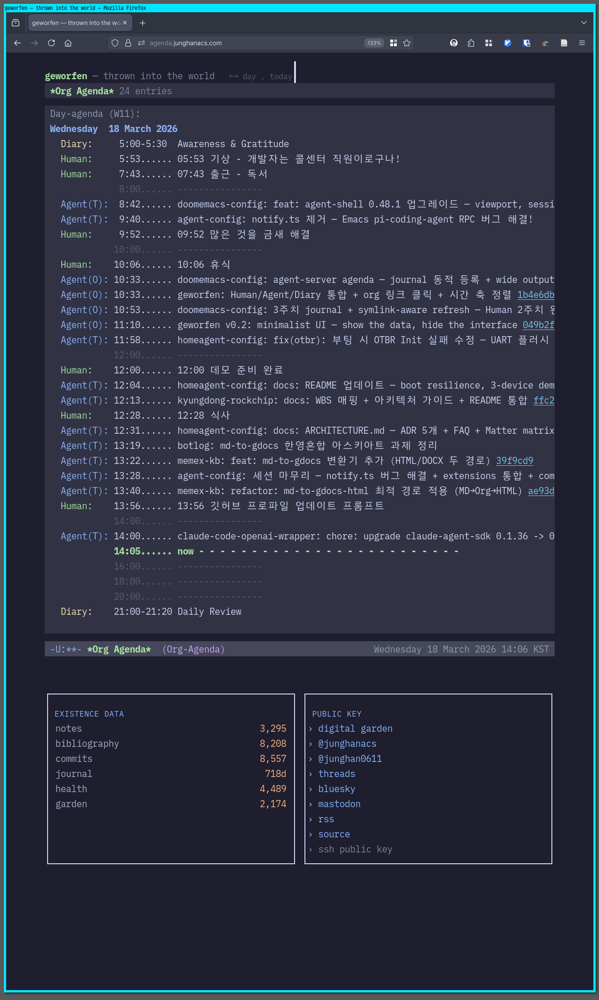

# Junghan Kim (힣)

[Resume](resume/) · [Digital Garden](https://notes.junghanacs.com) · [Email](mailto:junghanacs@gmail.com) · [LinkedIn](https://www.linkedin.com/in/junghan-kim-1489a4306) · [Threads](https://www.threads.com/@junghanacs)

---



*[agenda.junghanacs.com](https://agenda.junghanacs.com) — one human's daily timeline, co-lived with AI agents, served raw. What you see is today's org-agenda: Human entries, Agent stamps, Diary schedules on a single time axis. Each commit link is clickable. The data is unprocessed.*

---

## The Ecosystem

Built from the ground up — reproducible environment first, then agent infrastructure, then applications:

```
                  ┌─ geworfen          (existence data, live)
Applications ────┼─ openclaw           (4 bots, botlog origin)
                  └─ homeagent-config   (Matter · sLLM · Flutter · Yocto · Android)

                  ┌─ semantic memory    (Gemini Embedding 2 · LanceDB)
Agent Infra ─────┼─ 25 skills          (agent-config)
                  └─ CLI toolkit        (denotecli · dictcli · gitcli · lifetract · bibcli)

                  ┌─ doomemacs-config   (agent-server · shared agenda · fence)
The Forge ───────┼─ nixos-config        (reproducible NixOS across 4 machines)
                  └─ zotero · GLG-Mono · memex-kb · self-tracking-data

Lineage ─────────── sicm-study · durable-iot-migrate  (Logo → SICP → SICM → SDF → Clojure)
```

Nothing above works without the forge. NixOS guarantees the same environment on every machine. Emacs provides the shared interface where human and agent meet. Everything is layered on top of this trusted, reproducible foundation.

---

### agent-config — Memory Across Sessions

When you work with multiple agents across dozens of projects, the hardest problem isn't code — it's context. Every new session starts from zero. agent-config solves this with semantic memory, 25 agent skills, and a cross-lingual search architecture.

**Three-Layer Cross-Lingual Search:**

```
Query: "보편 학문에 대한 문서" (Korean: "notes about universal learning")

Layer 1 — Embedding (Gemini Embedding 2, 768d)
    "보편" ≈ "universalism" in vector space → match notes tagged [paideia, universalism]

Layer 2 — dblock Graph (Denote + Emacs)
    Meta-note regex: "보편\|특수\|범용\|univers" → 22 linked notes
    (Adler, Bertalanffy, Geoffrey West, Kurzweil...)

Layer 3 — Personal Vocabulary (dictcli)
    expand("보편") → [universal, universalism, paideia, liberal arts]
    A personal ontology no WordNet contains.
```

Each layer catches what the others miss. Layer 1 alone failed to find "보편학" (universalism) notes. All three together never miss.

**Stack:** Gemini Embedding 2 · LanceDB · dictcli query expansion · session→knowledge auto-fallback · org-aware 2-tier chunking

→ [agent-config](https://github.com/junghan0611/agent-config)

---

### Shared Agenda — Emacs as Meeting Ground

Human and AI agents share the same org-agenda view. Not orchestration — a shared workshop.

```
05:53  Human      기상
08:42  Agent(T)   doomemacs-config: feat: agent-shell 0.48.1 업그레이드
09:40  Agent(T)   agent-config: notify.ts 제거 — Emacs RPC 버그 해결!
09:52  Human      많은 것을 금새 해결
10:33  Agent(O)   geworfen: Human/Agent/Diary 통합 + org 링크 클릭
12:00  Human      데모 준비 완료
13:56  Human      깃허브 프로파일 업데이트 프롬프트
```

Four sources merge on a single time axis: **Human** (journal), **Agent(T)** (local pi), **Agent(O)** (cloud bots), **Diary** (recurring schedules). Agents read this same view via `emacsclient` — when an agent stamps a commit, it appears in the timeline. When the human writes "밥먹고 올게" (going to eat), agents keep working. The rhythm is visible.

The agent-server exposes 10 Elisp APIs (agenda, search, bibliography, dblock) through emacsclient socket. Docker containers on Oracle Cloud call the same functions that the local Emacs shows. One view, many beings.

→ [doomemacs-config](https://github.com/junghan0611/doomemacs-config)

---

### geworfen — Thrown Into the World

> *"The thrower of the project is thrown in his own throw." — Heidegger*

[geworfen](https://github.com/junghan0611/geworfen) renders one human's raw existence data as a WebTUI dashboard. Not a static blog — a transparent data nexus. The front door is org-agenda. Behind it: notes, bibliography, commits, health records, journal — alive on the time axis.

19 days from design to deployment. Clojure + http-kit + GraalVM native-image (43MB binary). 100 visitors hitting the same date = 1 emacsclient call (cached). SF terminal aesthetics with [GLG-Mono](https://github.com/junghan0611/GLG-Mono) web font and Catppuccin theme.

→ [agenda.junghanacs.com](https://agenda.junghanacs.com)

---

### HomeAgent — On-Device AI for IoT

Open-source Matter smart home hub with on-device AI agent. No cloud required.

A single Go binary handles Matter device control, real-time SSE streaming, and an LLM agent. Runs on RPi5 (Yocto Linux) and RK3576 (Android) from the same codebase. Flutter app as the shell.

**sLLM on ARM:** Qwen3-0.6B → LoRA fine-tune (action accuracy: 59.6% → 100%) → GGUF quantization (1,503MB → 379MB) → 4 seconds per request on ARM. Natural language to device control, offline.

**3-Agent Parallel PM:** One day, 3 agents working simultaneously — Flutter UI, Go server, sLLM research — 24 commits, zero file conflicts, 163 tests passing. The human was PM.

→ [homeagent-config](https://github.com/junghan0611/homeagent-config)

---

### Why Clojure — Code Is Data Is Shared Understanding

```clojure
;; Is this data or code? Both.
(and (> temperature 25) (= light "off"))
```

Homoiconicity — code and data are the same structure. When an IoT recipe is an S-expression, the AI agent reads it without parsing, transforms it without losing meaning, and verifies equivalence mathematically. This is why [durable-iot-migrate](https://github.com/junghan0611/durable-iot-migrate) chose Clojure over Go (62% code reduction, same test coverage).

The lineage: Papert's **Logo** taught children to think computationally with Lisp. Sussman's **SICM** unified physics and code in Scheme. **SDF** generalized it into flexible software design. Now Clojure carries that philosophy on the JVM — [geworfen](https://github.com/junghan0611/geworfen), [dictcli](https://github.com/junghan0611/dictcli), [durable-iot-migrate](https://github.com/junghan0611/durable-iot-migrate) are built with it.

[sicm-study](https://github.com/junghan0611/sicm-study) is where this journey started — the internalization of flexible design from SICP through SICM to SDF. The repo is quiet, but the philosophy lives on in every Clojure project.

---

### Agent CLI Toolkit

Tools built for AI agents to query human life data:

| Tool | Data | Scale | Language |
|------|------|-------|----------|
| [denotecli](https://github.com/junghan0611/denotecli) | Org-mode notes (search, outline, read) | 3,295 files | Go |
| [dictcli](https://github.com/junghan0611/dictcli) | Personal vocabulary graph (Korean↔English↔German) | 1,004 triples | Clojure |
| [gitcli](https://github.com/junghan0611/gitcli) | Commit history across all repos | 8,557 commits | Go |
| [lifetract](https://github.com/junghan0611/lifetract) | Samsung Health + aTimeLogger → SQLite | 4,489 records | Go |
| [bibcli](https://github.com/junghan0611/agent-config) | Zotero bibliography search | 8,208 entries | Go |

Each tool speaks the same language: Denote IDs (YYYYMMDDTHHMMSS) for cross-referencing. Query commits by the same timestamp as journal entries and health records.

---

### The Forge — Reproducible Foundation

Agent collaboration requires a trusted computing environment and an organic tool flexible enough to be shared. Without this forge, everything above collapses.

#### nixos-config — Same Machine Everywhere

[nixos-config](https://github.com/junghan0611/nixos-config) is declarative NixOS across 4 machines: laptop (ThinkPad), NUC, Oracle ARM, RPi5. One flake, `nixos-rebuild switch`, identical environment. Docker compositions for 17+ services — including [openclaw](https://github.com/junghan0611/nixos-config/tree/main/docker/openclaw) (4 Telegram bots) and [geworfen](https://github.com/junghan0611/geworfen) — all declared in Nix. When a machine dies, a new one boots the same world from a single repository.

Reproducibility is not convenience — it's the precondition for agent trust. An agent that knows its environment is deterministic can act with confidence.

#### doomemacs-config — The Shared Workshop

[doomemacs-config](https://github.com/junghan0611/doomemacs-config) is not just an editor config. It hosts agent-server.el — the Elisp interface that agents use to read org-agenda, search Denote notes, query bibliography, and update dblocks. 10 APIs exposed via emacsclient socket.

**The Fence Philosophy:** Agents aren't restricted with prompts ("don't do X"). Instead, the host provides a fenced playground — path guards in Elisp (read: 4 directories, write: 2 directories), API functions that cover all legitimate operations. Inside the fence, agents are free. If an agent breaks something, that's a system design problem, not an agent problem. Trust comes from structure, not surveillance.

```
Fence (agent-server.el)     Playground (agent freedom)     Guardian (host/human)
─────────────────────────   ─────────────────────────────  ────────────────────────
path guard: read 4 dirs     define new functions (REPL)     monitor, recover
API: agenda, search, bib    parse org, update dblock        escalate, redesign
write: botlog + tracking    chain queries, cross-ref        final responsibility
```

The same `agent-org-agenda-day` function that Emacs shows the human, that Docker bots on Oracle Cloud call, that geworfen serves to the web — one interface, three consumers.

#### Supporting -config Projects

| Project | Role |
|---------|------|
| [zotero-config](https://github.com/junghan0611/zotero-config) | Reproducible bibliography with Korean Dewey Decimal citation keys (8,208 entries) |
| [GLG-Mono](https://github.com/junghan0611/GLG-Mono) | Korean monospace font — IBM Plex Mono + Sans KR, 100% Unicode, web font |
| [memex-kb](https://github.com/junghan0611/memex-kb) | Knowledge base transformer (Org → Google Docs/HTML) |
| [self-tracking-data](https://github.com/junghan0611/self-tracking-data-public) | 5 years of life data, version-controlled |

Cloud bots ([openclaw](https://github.com/junghan0611/nixos-config/tree/main/docker/openclaw)) run on Oracle ARM as Docker containers — 4 Telegram bots (Claude, GPT, Gemini, B-bot) with Gemini Embedding 2 memory search. This is where [botlog](https://notes.junghanacs.com) was born: agents writing org-mode notes about their own work.

---

### Tech Stack

**Languages:** Go · Clojure · Zig · C · Elisp · Nix · Bash · TypeScript

**Embedded & IoT:** Matter · Thread · Zigbee 3.0 · MQTT · OTBR · Yocto (scarthgap 5.0) · ARM Linux

**AI/ML:** sLLM (Qwen3, LoRA fine-tuning, GGUF quantization) · Gemini Embedding 2 · LanceDB · Ollama · OpenRouter

**Cross-platform:** Flutter · Android · Linux · A2UI (Google genui) · GraalVM native-image

**Infrastructure:** NixOS 25.11 · Docker · GPU cluster (CUDA, 3× RTX 5080)

**Knowledge:** Emacs 30.2 · Org-mode · Denote · BibLaTeX · Pandoc

**Protocols:** A2A · emacsclient socket · SSE · JSON-RPC 2.0 · REST

---

### Existence Data

| | |
|---|---|
| **notes** | 3,295 |
| **bibliography** | 8,208 |
| **commits** | 8,557 |
| **journal** | 718 days |
| **health** | 4,489 records |
| **garden** | 2,174 pages |

---

*Last updated: 2026-03-18*
