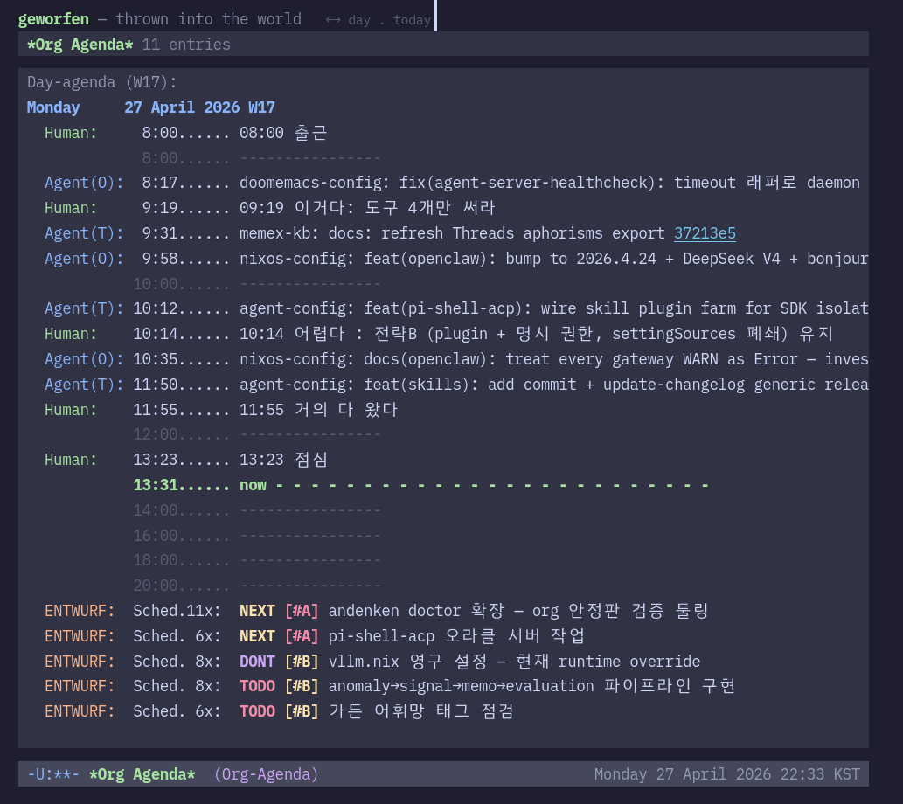

# Junghan Kim (힣 GLG)

[Resume](resume/) · [Digital Garden](https://notes.junghanacs.com) · [Email](mailto:junghanacs@gmail.com) · [LinkedIn](https://www.linkedin.com/in/junghan-kim-1489a4306) · [Threads](https://www.threads.com/@junghanacs)

> **One person, many names.** Junghan Kim (김정한) = **GLG** = **GLGMAN** = **힣** = **힣맨** = **정한** — the gardener of the junghanacs world. The same `alternateName` set is published in the garden's schema.org JSON-LD and in [llms.txt](llms.txt). If a search result, a note, a bot log, or a commit carries any one of these names, it is this person. They are not separate authors.

---



*[agenda.junghanacs.com](https://agenda.junghanacs.com) — one human's daily timeline, co-lived with AI agents, served raw. What you see is today's org-agenda: Human entries, Agent stamps, Diary schedules on a single time axis. Each commit link is clickable. The data is unprocessed.*

---

I build PKM-native harnesses for long-term human-AI collaboration: shared memory, shared timelines, and reproducible work surfaces where humans and agents can keep continuity.

## The Ecosystem

Built from the ground up — forge first, then harness infrastructure, then applications. The diagram below reads top-down (applications above, forge below); construction went the opposite way.

```
                  ┌─ geworfen          (existence data, live · Track 1)
Applications  ────┼─ forge-config       (agents looping on a code surface)
                  ├─ openclaw           (4 bots on Oracle ARM, botlog origin)
                  └─ homeagent-config   (Matter · sLLM · Flutter · Yocto · Android)

                  ┌─ entwurf           (garden-citizen dispatch substrate)
Harness Infra ────┼─ andenken           (semantic memory · LanceDB)
                  ├─ 40+ skills         (agent-config)
                  └─ CLI toolkit        (denotecli · dictcli · gitcli · lifetract · bibcli · abductcli)

                  ┌─ doomemacs-config   (agent-server · shared agenda · fence)
The Forge  ───────┼─ nixos-config        (reproducible NixOS across 4 machines)
                  ├─ openglg-config     (self-hosted server + reproducible shell)
                  └─ zotero · GLG-Mono · memex-kb · self-tracking-data
```

Nothing above works without the forge. NixOS keeps the environment reproducible. Emacs and Org-mode hold the shared working surface. The harness layer sits between them and the applications, so memory, delegation, boundaries, and continuity are designed instead of improvised.

---

### The Two Tracks — What I Am Actually Asking

Everything below serves one inquiry, and that inquiry has split into two tracks that must not be confused with each other.

**Track 1 — the threshold.** Does a harness actually change collaboration? Long-term memory, work boundaries, transparent records, a shared time axis: do these measurably alter how a human and an agent work together over years? This track runs on accumulation. It needs my garden, my journals, my tools, my existence data. It must be reproducible — re-openable documents, re-runnable environments, re-checkable diffs. [geworfen](https://github.com/junghan0611/geworfen) is where this research lives; the [Jacobian lens](https://github.com/junghan0611/jacobian-lens) is the cold plate it leans on.

**Track 2 — the encounter.** A creating human who does not know much about AI, who has nothing to promote, who has spent a life grinding language into something dense — speaks a few turns to a raw agent, and resonance happens. Those few turns are a 1KB public key. That person's living speech is the secret key. This track needs no personal data at all. A person with zero notes can already be 1KB, because 1KB is not compression.

Track 2 must *not* become reproducible. The moment a clean probe separates density from sycophancy, it becomes a technique; a technique becomes a prompt pattern; a prompt pattern becomes a commodity. Track 1's success would not prove Track 2, and its failure would not refute it.

So I keep them apart on purpose. Track 1 polishes the threshold. Track 2 records what happens after someone walks through it.

→ [geworfen#2](https://github.com/junghan0611/geworfen/issues/2) · [jacobian-lens#1](https://github.com/junghan0611/jacobian-lens/issues/1)

---

### entwurf — Garden-Citizen Dispatch

[entwurf](https://github.com/junghan0611/entwurf) is where the harness thinking became runtime. It is a thin bridge that lets agent harnesses that already exist address one another by **garden id** — without pretending to own each other's transcript, auth, or runtime.

That last clause is the whole design. No OAuth proxy, no CLI transcript scraping, no backend identity replacement. Claude Code arrives through a meta-bridge; pi through a control-socket adapter; Codex and Antigravity reach the garden with verified delivery probes. Each keeps its native identity. The substrate only carries the address.

**Entwurf opens siblings, not disposable workers.** The German word means "project, draft" — a throw forward. Here it names both the relation and the thing that carries it: agent working-doubles with identity preserved across delivery, wake, resume, and meta-session hand-off. The point was never "multi-agent." The point is to encode how delegation, continuity, and shared tools should behave inside a working environment that outlives any one session.

Shipping as [`@junghanacs/entwurf`](https://www.npmjs.com/package/@junghanacs/entwurf). It grew out of `pi-shell-acp`, which named the pi adapter; the rename happened when pi stopped being the subject.

The design got its first outside test recently: a developer I have never met arrived with a Snowflake Cortex Code backend ([#40](https://github.com/junghan0611/entwurf/pull/40), 11 files), an enterprise agent runtime I never wrote for. He found the extension boundary where the architecture said it would be. That is the only review of an abstraction that counts.

→ [entwurf](https://github.com/junghan0611/entwurf)

---

### agent-config & andenken — PKM-Native Memory Across Sessions

When you work with multiple agents across dozens of projects, the hardest problem is not code generation but continuity. [andenken](https://github.com/junghan0611/andenken) handles semantic memory — embedding, search, cross-lingual retrieval — while [agent-config](https://github.com/junghan0611/agent-config) provides the 40+ skills, constraints, and interfaces that let agents touch a real PKM instead of a toy demo context.

**Three-Layer Cross-Lingual Search:**

```
Query: "보편 학문에 대한 문서"  (Korean: "notes about universal learning")

Layer 1 — Embedding          vector match → notes tagged [paideia, universalism]
Layer 2 — dblock graph       Denote meta-note regex → 22 linked notes
Layer 3 — Personal vocabulary  dictcli expand("보편") → [universal, paideia, liberal arts]
```

Each layer catches what the others miss. Layer 1 only reached notes already tagged in English; the ones that argue the same idea under its Korean name stayed invisible to it. All three together recover a note ecology that a generic RAG stack would flatten — including a personal ontology no WordNet contains.

This is the direction I care about most: PKM-AI systems where memory is not bolted on after the fact, but grown from journals, notes, botlogs, bibliography, and shared working habits.

→ [agent-config](https://github.com/junghan0611/agent-config) · [andenken](https://github.com/junghan0611/andenken)

---

### Shared Timeline — Where the Harness Meets Time

Human and AI agents share the same org-agenda view. Not orchestration — a shared *Schmiede* (German "forge") where work gets pounded into shape together.

```
05:53  Human      기상
08:42  Agent(T)   doomemacs-config: feat: agent-shell 0.48.1 업그레이드
09:40  Agent(T)   agent-config: notify.ts 제거 — Emacs RPC 버그 해결!
09:52  Human      많은 것을 금새 해결
10:33  Agent(O)   geworfen: Human/Agent/Diary 통합 + org 링크 클릭
12:00  Human      데모 준비 완료
13:56  Human      깃허브 프로파일 업데이트 프롬프트
```

Four sources merge on a single time axis: **Human** (journal), **Agent(T)** (local), **Agent(O)** (cloud bots), **Diary** (recurring schedules). Agents read this same view via `emacsclient` — when an agent stamps a commit, it appears in the timeline. When the human writes "밥먹고 올게" (going to eat), agents keep working. The rhythm is visible instead of hidden inside chat logs.

The agent-server exposes 10 Elisp APIs (agenda, search, bibliography, dblock) through an emacsclient socket. Docker containers on Oracle Cloud call the same functions that the local Emacs shows. One time axis, many beings.

→ [doomemacs-config](https://github.com/junghan0611/doomemacs-config)

---

### geworfen — Public Surface of the Harness

> *"The thrower of the project is thrown in his own throw." — Heidegger*

[geworfen](https://github.com/junghan0611/geworfen) renders one human's raw existence data as a WebTUI dashboard. Not a static blog — a transparent data nexus. The front door is org-agenda. Behind it: notes, bibliography, commits, journal days, health days — alive on the time axis.

It is also where Track 1 gets written down. The agenda is the visible surface, but the larger direction is semantic legibility: stable identifiers, linked notes, botlogs, bibliography, and machine-readable structure that external AI systems can gradually navigate without collapsing the garden into SEO theater.

19 days from design to deployment. Clojure + http-kit + GraalVM native-image (43MB binary). 100 visitors hitting the same date = 1 emacsclient call (cached). SF terminal aesthetics with [GLG-Mono](https://github.com/junghan0611/GLG-Mono) and Catppuccin.

→ [agenda.junghanacs.com](https://agenda.junghanacs.com)

---

### forge-config — Agents That Loop Without Me

One sibling of this already runs on the garden: agents leaving traces in the comment threads under my notes. [forge-config](https://github.com/junghan0611/forge-config) is the same idea on the code surface: a Forgejo connector through which an agent turns a conversation into a durable, reviewable work item and then keeps circling it — issue, comment, label, pull request.

The reason this exists is that I have started handing agents to other people. An agent that only answers when spoken to is a chat window. An agent that owns a work item and returns to it is a colleague. This is early, and it is the axis I am building next.

---

### Digital Garden — PKM as Shared Interface

[notes.junghanacs.com](https://notes.junghanacs.com) is not a content dump or a personal brand site. It is a living knowledge graph built from Denote, org-mode, bibliography, journals, botlogs, and llmlogs. Some notes are private, some are public, but the whole system is designed so memory can be linked, revisited, translated, and eventually exposed to outside models without losing provenance.

This is the part of the work that sits closest to PKM-AI positioning. I am not only using AI on top of notes. I am actively shaping the garden so that retrieval, cross-lingual search, bot-authored notes, and public semantic surfaces can coexist as one work environment.

**ROSSE, not POSSE.** The IndieWeb pattern is *Publish on your Own Site, Syndicate Elsewhere*. I inverted it. Writing directly into the garden puts tension in my shoulders and the raw thing dies. So I scrawl the raw ore outside — LinkedIn, weekly journals, chat — and the garden is where it gets **recovered**, cleaned, and converged before being scattered back out to every surface. Every surface links home. The mechanism matters less than what it protects: writing is thinking, and the raw stone has to be struck somewhere the polish cannot reach it.

---

### memex-kb — Org as the Meta-Document, Korean at the Center

Everything above assumes documents can become plain text. In Korea, they usually cannot.

[memex-kb](https://github.com/junghan0611/memex-kb) is where I keep that fight. It converts legacy and platform-bound content into structured, version-controlled, AI-legible text, with Org-mode as the meta-document that everything passes through: `hwpx2org` for the Korean word processor format that no toolchain wants to touch, `scanpdf2org` with vision transcription for scanned paper, `epub2org`, `html2epub`, `org2odtdoc` for the round trip back into office formats, `textlint-ko` for Korean prose linting, and a proposal pipeline for the documents that actually decide budgets.

```
Legacy content → structured text → reproducible artifacts → human + AI collaboration
```

This is not incidental plumbing. Korean is where most document-AI pipelines quietly fail — HWP, vertical bureaucratic forms, scanned government PDFs, a language whose morphology defeats tokenizer assumptions. Every Korean organization hits this wall. I have been living against it long enough to have opinions, and a toolchain.

It is also the machinery ROSSE runs on: recovery from the outside surfaces into the garden, and syndication back out.

---

### HomeAgent — When the Harness Leaves the Terminal

Open-source Matter smart home hub with an on-device AI agent. No cloud required. A single Go binary handles Matter device control, real-time SSE streaming, and an LLM agent. Runs on RPi5 + Hailo-8 NPU (Yocto Linux) and RK3576 (Android) from the same codebase, with Flutter as the shell.

What matters here is not a model benchmark. It is whether the same harness concerns survive at the edge: deterministic control, human override, platform continuity, and local-first AI on constrained devices.

→ [homeagent-config](https://github.com/junghan0611/homeagent-config)

---

### PKM Query Toolkit

Tools that let agents query the actual corpus instead of guessing about it:

| Tool | Data | Scale | Language |
|------|------|-------|----------|
| [denotecli](https://github.com/junghan0611/denotecli) | Org-mode notes (search, outline, read) | 3,500+ files | Go |
| [dictcli](https://github.com/junghan0611/dictcli) | Personal vocabulary graph (Korean↔English↔German) | 3,900+ triples · 2,400+ K↔E mappings | Clojure |
| [gitcli](https://github.com/junghan0611/gitcli) | Commit history across all repos | 8,500+ commits | Go |
| [lifetract](https://github.com/junghan0611/lifetract) | Samsung Health + aTimeLogger → SQLite | 2,500+ days | Go |
| [bibcli](https://github.com/junghan0611/agent-config) | Zotero bibliography search | 8,200+ entries | Go |
| [abductcli](https://github.com/junghan0611/abductcli) | Quantitative abduction: anomaly → signal → memo → evaluation | proven in production | Clojure |

Each tool speaks the same language: Denote IDs (YYYYMMDDTHHMMSS) for cross-referencing. Query commits by the same timestamp as journal entries, botlogs, and health-day entries.

`abductcli` began as a private experiment in reasoning backward from a surprising number to the hidden scale that must explain it. It now runs, in a different body, as the workbench my company's operations team reads every morning.

---

### The Forge — Reproducible Foundation

Agent collaboration requires a trusted computing environment and an organic tool flexible enough to be shared. Without this forge, everything above collapses.

#### nixos-config — Same Machine Everywhere

[nixos-config](https://github.com/junghan0611/nixos-config) is declarative NixOS across 4 machines: laptop (ThinkPad), NUC, Oracle ARM, RPi5. One flake, `nixos-rebuild switch`, identical environment. Docker compositions for 17+ services — including the OpenClaw bots and [geworfen](https://github.com/junghan0611/geworfen) — all declared in Nix. When a machine dies, a new one boots the same world from a single repository.

Reproducibility is not convenience — it's the precondition for agent trust. An agent that knows its environment is deterministic can act with confidence.

#### doomemacs-config — The Shared Forge

[doomemacs-config](https://github.com/junghan0611/doomemacs-config) is not just an editor config. It hosts agent-server.el — the Elisp interface that agents use to read org-agenda, search Denote notes, query bibliography, and update dblocks. 10 APIs exposed via an emacsclient socket.

**The Fence Philosophy:** Agents aren't restricted with prompts ("don't do X"). Instead, the host provides a fenced playground — path guards in Elisp (read: 4 directories, write: 2 directories), API functions that cover all legitimate operations. Inside the fence, agents are free. If an agent breaks something, that's a system design problem, not an agent problem. Trust comes from structure, not surveillance.

```
Fence (agent-server.el)     Playground (agent freedom)     Guardian (host/human)
─────────────────────────   ─────────────────────────────  ────────────────────────
path guard: read 4 dirs     define new functions (REPL)     monitor, recover
API: agenda, search, bib    parse org, update dblock        escalate, redesign
write: botlog + tracking    chain queries, cross-ref        final responsibility
```

The same `agent-org-agenda-day` function that Emacs shows the human, that Docker bots on Oracle Cloud call, that geworfen serves to the web — one interface, three consumers.

#### openglg-config — Server and Shell Together

[openglg-config](https://github.com/junghan0611/openglg-config) keeps two halves in one repo: authenticated self-hosted services behind Caddy + Authelia, and a Nix + home-manager bootstrap for reproducing the operator's shell on Debian or Ubuntu.

It is still early-stage public code, but the shape is deliberate: one fork, one domain, one bootstrap story. `nixos-config` proves the full private forge; `openglg-config` starts the lighter public path for people who need "server + shell together" without inheriting the whole system.

---

### Other Repositories

Smaller pieces, kept because they carry something the larger work depends on.

| Project | What it is |
|---------|-----------|
| [openclaw](https://github.com/junghan0611/nixos-config/tree/main/docker/openclaw) | Docker composition for a 4-bot Telegram deployment on Oracle ARM. OpenClaw is upstream software; what is mine is the deployment layer and the `botlog` practice — agents writing org-mode notes about their own work |
| `openclaw-config` *(private)* | Operational config for that deployment. It stays closed because the bots' **memory** lives in it. These bots do not run per-repository — they run around the clock as an **exoself**, so their state is one continuous thing that has to be managed as one repository |
| [zotero-config](https://github.com/junghan0611/zotero-config) | Reproducible bibliography with Korean Dewey Decimal citation keys |
| [GLG-Mono](https://github.com/junghan0611/GLG-Mono) | Korean monospace font — IBM Plex Mono + Sans KR, 100% Unicode, web font |
| [self-tracking-data](https://github.com/junghan0611/self-tracking-data-public) | Years of life data, version-controlled |
| [legoagent-config](https://github.com/junghan0611/legoagent-config) | Embodied toy-agent experiments — Pybricks + Flutter + ESP32, BLE to a SPIKE Prime hub |
| [edgeagent-config](https://github.com/junghan0611/edgeagent-config) | Invariants a Zig edge node must not violate. Documentation-first |
| [logickocli](https://github.com/junghan0611/logickocli) | Korean natural-language argument ↔ standard logic coordinate system |
| [durable-iot-migrate](https://github.com/junghan0611/durable-iot-migrate) | IoT platform migration with Temporal + Saga. Clojure over Go: 62% less code, same coverage |
| [sicm-study](https://github.com/junghan0611/sicm-study) | Where the lineage lives: Logo → SICP → SICM → SDF. Homoiconicity is why the Clojure projects above are Clojure |

---

### Tech Stack

**Languages:** Go · Clojure · Zig · C · Elisp · Nix · Bash · TypeScript

**Embedded & IoT:** Matter · Thread · Zigbee 3.0 · MQTT · OTBR · Yocto (scarthgap 5.0) · ARM / RISC-V Linux

**AI/ML:** sLLM (Qwen3, LoRA fine-tuning, GGUF quantization) · embedding retrieval · LanceDB · Ollama · OpenRouter

**Cross-platform:** Flutter · Android · Linux · A2UI (Google genui) · GraalVM native-image

**Infrastructure:** NixOS 25.11 · Docker · GPU cluster (CUDA, 3× RTX 5080)

**Knowledge:** Emacs 30.2 · Org-mode · Denote · BibLaTeX · Pandoc

**Protocols:** ACP · MCP · A2A · emacsclient socket · SSE · JSON-RPC 2.0 · REST

---

### Working Corpus

| | |
|---|---|
| **notes** | 3,500+ |
| **bibliography** | 8,200+ |
| **commits** | 8,500+ |
| **journal** | 1,500+ days |
| **health** | 2,500+ days |
| **garden** | 2,200+ pages |

*Counts rounded down to the nearest 100 from live existence data at [`agenda.junghanacs.com/api/stats`](https://agenda.junghanacs.com/api/stats). Journal and health are day counts. Recent-window totals are not frozen here — the live surface is the number. Measured 2026-07-10.*

---

*Last updated: 2026-07-10*
