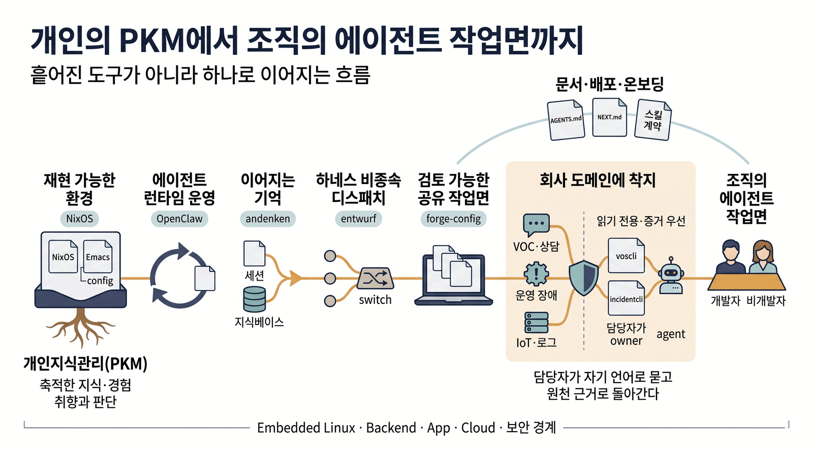
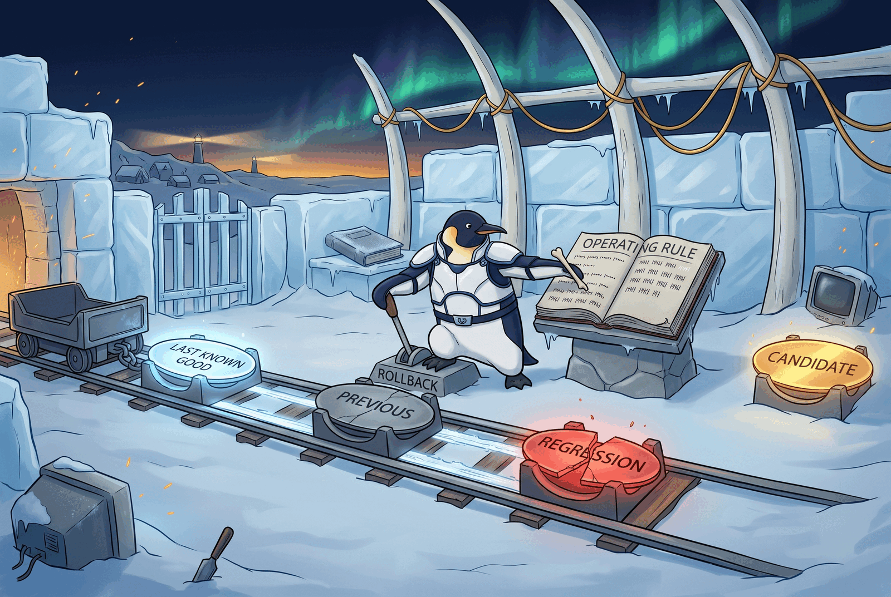
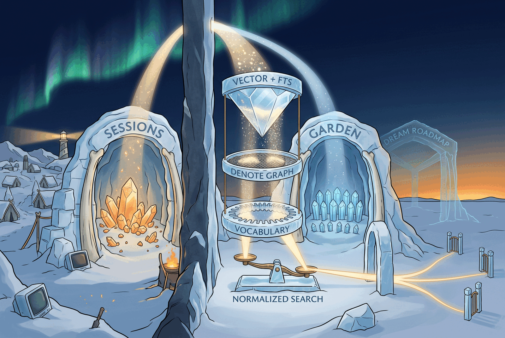
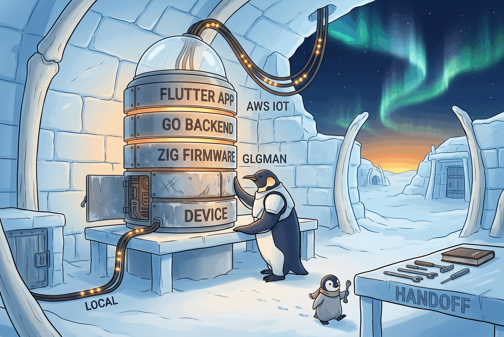

#+title:      에이전트 플랫폼 운영과 조직 AX 전환
#+subtitle:   Linux 인프라에서 메모리·디스패치·개발 루프·문서 전파까지
#+author:     김정한 (Junghan Kim)
#+date:       2026-07-15
#+language:   ko
# toc:nil / title:nil / author:nil / date:nil — an in-buffer #+options beats the export
# plist, so build.el could not turn these off from the outside. The web record's TOC is
# pandoc's (--toc), not this; title/author/date there come from pandoc --metadata, also
# untouched by this line. For LaTeX, the raw acmart block below (\title, \subtitle,
# \affiliation, \email, \maketitle) is the SSOT — ox-latex's own title:t/author:t/date:t
# would print Org's topmatter *in addition to* that block's \maketitle, doubling both.
#+options:    toc:nil num:nil title:nil author:nil date:nil broken-links:t
#+html_head:  <meta name="description" content="최근 1년의 AX·에이전트 플랫폼 작업을 코드, 운영 기록, 제3자의 행동, 공개 시간축으로 검증하는 기록면">

# The typesetting below descends from the private dossier's pipeline/preamble.org. It is
# transplanted rather than reinvented: the same Org source has to be able to leave through
# either surface, and a second, independently-tuned frame is how two documents from one
# author start disagreeing about what they look like. `screen' turns on acmart's coloured
# hyperlinks — this document is read in a browser and as a PDF full of citations to public
# URLs, so a link that does not look like one is a link nobody follows.
#+latex_class: axpaper
#+latex_class_options: [manuscript,nonacm,screen]
#+latex_compiler: xelatex

# Hangul typesetting. The flake pins these two faces as build inputs — if the receiving
# machine lacks them XeTeX quietly substitutes and the page still comes out, so leaving
# fonts to the environment breaks "the same source yields the same document".
#+latex_header: \usepackage{xetexko}
#+latex_header: \setmainhangulfont{Pretendard}[Ligatures=TeX]
#+latex_header: \setsanshangulfont{Pretendard}
#+latex_header: \setmonohangulfont{D2Coding}
#+latex_header: \setmainfont{Pretendard}[Ligatures=TeX]
#+latex_header: \setmonofont{D2Coding}[Scale=0.92]

# Hanja needs a face of its own. Pretendard carries no hanja glyphs, so a single character
# leaves a "Missing character" line in the XeTeX log and a blank space in the PDF — the page
# renders fine, so nothing catches it but an eye. D2Coding is already a build input and has
# the glyphs, closing the hole without adding a font (xetexko splits on script).
#+latex_header: \setmainhanjafont{D2Coding}

# ACM's bibliography and copyright apparatus, off. This document is not submitted to ACM;
# it borrowed the typesetting.
#+latex_header: \settopmatter{printacmref=false}
#+latex_header: \setcopyright{none}
#+latex_header: \acmDOI{}
#+latex_header: \acmISBN{}
#+latex_header: \pagestyle{plain}

# The author's contact is carried by the title block, not by acmart's first-page
# `authorsaddresses' footnote. Leaving the footnote in prints the same information twice on
# one page. An empty value removes that block.
#+latex_header: \authorsaddresses{}
#+latex_header: \usepackage{array}

# A4 is 0.59cm narrower than the letter block acmart assumed, which is enough to leave a
# justified line a couple of points short of fitting — the generated timeline reading has a
# run of `label(count) · label(count)` that missed by 2.03pt. That content is generated by
# the shared observatory skill and must not be hand-edited, so the fix belongs in the
# typesetting. \emergencystretch gives TeX one more pass with extra interword stretch.
# 1em was measured first and did **not** clear it; 3em does. The value is what the document
# actually needed, not a round number chosen in advance.
#
# It is deliberately a weak instrument: it can only stretch glue that already exists. The
# other way these PDFs overflow — a table cell holding one unbreakable token wider than its
# column, which is how three of the four Overfull boxes here appeared — has no glue to
# stretch, so this cannot quietly absorb that class and leave the gate reporting clean.
# Those were fixed by sizing the columns. Verified by reverting: with this line at 3em, a
# widened token still trips `make check`.
#+latex_header: \setlength{\emergencystretch}{3em}

# ── Heading hierarchy ────────────────────────────────────────────────────────────────
# acmart's manuscript format is built for reviewers: section, subsection and subsubsection
# all set at body size, separated by weight and italic alone (\@secfont and friends give no
# size). A reviewer reads that way happily; this document has to let a first-time reader
# skim and find the structure. Sizes make four visible steps.
#
# Subsubsection defaults to italic, which is not a hierarchy signal in Korean — Hangul
# italic is a slant applied to a face that has none. Since it is being sized anyway, it
# moves to weight and joins the same grammar as the rest.
#
# These touch @-internal names, hence \makeatletter. acmart sets them in a per-format
# \ifcase, so this preamble redefinition is the one that lands last and wins.
#+latex_header: \makeatletter
#+latex_header: \def\@titlefont{\Huge\sffamily\bfseries}
#+latex_header: \def\@subtitlefont{\large\mdseries}
#+latex_header: \def\@secfont{\sffamily\bfseries\LARGE\section@raggedright}
#+latex_header: \def\@subsecfont{\sffamily\bfseries\Large\section@raggedright}
#+latex_header: \def\@subsubsecfont{\sffamily\bfseries\large\section@raggedright}
#+latex_header: \makeatother

# Caption labels in Korean. This document is Korean throughout and now carries five
# figures, so an English "Fig. 1." is the one line on the page written in another language.
# The label is owned by the caption package, not by \figurename: acmart fixes it with
# \captionsetup{name=Figure}, so \renewcommand{\figurename}{그림} is silently ignored and
# the PDF keeps printing "Fig." — it has to be overridden at the same layer.
#+latex_header: \captionsetup[figure]{name=그림,labelsep=period}
#+latex_header: \captionsetup[table]{name=표,labelsep=period}

#+begin_export latex
\title{에이전트 플랫폼 운영과 조직 AX 전환}
\subtitle{Linux 인프라에서 메모리·디스패치·개발 루프·문서 전파까지}
\author{김정한 (Junghan Kim)}
\affiliation{\institution{Independent Engineer}\country{Republic of Korea}}
\email{junghanacs@gmail.com}
\maketitle
#+end_export

* 저는 PKM-AI 가드너입니다. AX도 결국 인간 생산성의 문제입니다. :d0:
:PROPERTIES:
:CUSTOM_ID: landing
:END:

AX를 도구 도입 문제로 읽으면 답은 도구 목록이 됩니다. 지난 1년간 제가 판 것은 그게 아닙니다.
*한 사람의 지식과 시간을 어디까지 가꿀 수 있는가,* 그리고 에이전트가 그 경계를 실제로 어디까지
밀어주는가 — 이것이 제 질문이었고, 매일의 기록으로 검증해 왔습니다.

그래서 저를 엔지니어나 개발자로 먼저 소개하지 않습니다. *엔지니어링은 정체성이 아니라 증거를
만드는 방법입니다.* 지식 기반을 가꾸는 사람이 에이전트를 운영 계층까지 끌고 내려간 기록 —
이 문서는 그 기록입니다.

가꾼 것은 말이 아니라 데이터로 남습니다. 저널 *1,500일 이상,* 노트 *3,500개 이상,* 서지
*8,200건 이상,* 커밋 *8,500개 이상,* 생활 기록 *2,500일 이상.* 지금 이 순간
[[https://agenda.junghanacs.com][라이브 통계]]에서 다시 셀 수 있는 숫자입니다.

그 기반 위에서 에이전트 런타임을 약 5개월간 *20회 이상의 버전 사이클로 운영했습니다.* 회귀가
났을 때는 계측해서 롤백했고, 재발을 막는 규칙을 문서로 못 박았습니다. 그 운영 경험은 한 제품
설정에 갇히지 않고 세 계층으로 분리되었습니다 — *메모리, 디스패치, 검토 가능한 개발 루프.*

*그래서, 이걸 얼마나 파보았는가.* 아래의 모든 큰 주장은 코드, 운영 인시던트, *제3자의 행동,*
라이브 집계, 공개 시간축으로 내려갑니다. 주장과 근거가 한 화면 안에 있습니다.

- [[file:record.html][Read the record — 깊은 기록면]]
- [[file:KimJunghan_AX_Overview.pdf][큰그림 — 깊이 0–1 PDF]]
- [[file:KimJunghan_AX_Record.pdf][기록 — 깊이 0–2 PDF]]
- [[file:KimJunghan_AX_Detail.md][상세 Markdown]]
- [[https://github.com/junghan0611][GitHub]] · [[https://notes.junghanacs.com][Digital Garden]] · [[https://agenda.junghanacs.com][Live Agenda]]

이 문서 자체가 하나의 증거입니다. Org 정본 한 장에서 =make= 한 번으로 이 웹 기록면과 읽기 깊이가
다른 PDF 2종, 상세 Markdown이 함께 재생성됩니다. "AI 문서를 작성하고 배포한다"를 주장하는 대신,
*문서가 만들어진 방식이 그 주장입니다.*

* 운영에서 분리된 다섯 축 :d1:
:PROPERTIES:
:CUSTOM_ID: axes
:END:

에이전트 도구를 /사용한/ 사람이 아니라, *에이전트 플랫폼을 운영하고 그 위에 자기 계층을 쌓은
사람입니다.* Linux 인프라 위에서 런타임을 운영하며 메모리, 디스패치, 검토 가능한 개발 루프,
그리고 사람이 이어받을 문서 체계를 만들었습니다.

*다섯 축은 나열이 아니라 한 줄기입니다.* 축1의 런타임 운영이 뿌리이고, 거기서 겪은 문제가
둘로 갈라져 축2의 기억 계층과 축3의 디스패치·검토 작업면이 되었습니다. 축4는 그렇게 분리된
계층을 이미 돌아가는 도메인에 적용한 자리이고, 축5는 그 아래에서 에이전트가 붙을 대상을
실제로 만들어 본 물리적 바닥입니다. *문서 체계는 여섯 번째 축이 아니라 다섯을 가로지르는
축입니다* — 각 계층을 다음 사람이 이어받게 만드는 일이라 어느 하나에 속하지 않습니다.

#+caption: 개인의 지식 관리에서 조직의 에이전트 작업면까지 — 사람이 오케스트레이터로 판단을
#+caption: 쥐고, 각 계층이 그 흐름을 받친다. 오른쪽 「회사 도메인에 착지」 구간은 비공개 수행을
#+caption: 일반화한 설명이며 외부에서 검증되지 않는다. 공개로 확인되는 것은 그 왼쪽의 다섯
#+caption: 계층이고, 무게는 거기에 둔다.
#+name: fig-ax-layer
#+attr_latex: :width 0.95\linewidth

** 1. 에이전트 런타임 운영 — OpenClaw :d1:

*** 맥락 :d1:

에이전트 런타임(OpenClaw)을 2026년 2월부터 6월까지 운영했습니다. Oracle Cloud ARM 인스턴스
위의 Docker, 메신저 채널 다중 연동, 매일의 일상 사용이 걸린 환경입니다.

핵심 조건이 하나 있습니다. *업스트림은 1인이 유지하는 프로젝트이고, 우리 조직에는 업스트림
담당자가 없습니다.* 그래서 "버전을 올린다"가 곧 "릴리즈의 의미를 내 환경으로 번역한다"가
됩니다. 이 조건이 판단의 배경입니다.

*** 판단의 핵심 :d1:

*롤백 대상을 고르는 기준이 이 프로젝트의 핵심 판단입니다.* "한 단계 내린다"가 아니라 이미
검증된 판으로 정확히 돌아가는 것 — 최신을 고집하지 않는 것과 아무 데나 되돌리는 것은
다릅니다. 그리고 진단 도구의 권고를 맥락 없이 따르지 않습니다. 우리 배포 환경에서 거짓
양성으로 판정되면 적용하지 않고, 그 판단을 규칙으로 남깁니다.

*** 인시던트 ① — 회귀를 계측하고, 정확한 판으로 되돌린다 :d2:

두 버전을 한 번에 건너뛴 뒤 응답 지연이 급증했습니다.

- 증상 :: 응답 latency 급증, =stuck session: state=processing age=164s=
- 계측 :: 게이트웨이 프로세스가 단일 스레드에서 CPU 102%로 회전. 자식 프로세스는 생성되지
  않음. 부팅 88초 — 정상은 11초.
- 가설 배제 :: 클린 부팅에서도 재현. 운영자 설정 오류가 아님을 입증.
- 근본 원인 가설 :: 콜드 영속화된 플러그인 레지스트리와 자동 수정 도구의 충돌. 레지스트리
  재빌드가 활성 플러그인을 축소시키고, 첫 요청이 핫패스 한복판에서 의존성 설치를 트리거.
- 롤백 대상 :: 한 단계 아래가 아니라 두 단계 아래의 마지막 정상 판. 이미지 생성 경로가 그
  판에서만 기존 인증으로 라우팅되기 때문.
- 검증 :: 준비 11.3초, 유휴 CPU 0.07%, stuck-session 진단 0건.
- 비용 :: 운영자 주의력 5시간.

*여기서 실제로 값이 나가는 판단은 롤백 대상 선택입니다.* "한 단계 내린다"가 아니라 /이미지
생성이 별도 API 키를 요구하지 않는 마지막 판이 어디인가/ 를 물었습니다. 최신을 고집하지 않는
것과 아무 데나 되돌리는 것은 다릅니다.

#+caption: 롤백 레버는 바로 뒤 =PREVIOUS= 가 아니라 그 너머 =LAST KNOWN GOOD= 을 가리킨다 —
#+caption: 최신을 고집하지 않는 것과 아무 데나 되돌리는 것은 다르다는 판단을 이 구도가 쥐고 있다.
#+name: fig-openclaw-ops
#+attr_latex: :width 0.82\linewidth

그리고 고친 것은 코드가 아니라 규칙입니다.

- 두 버전 건너뛰기 금지, wait-and-watch.
- 비프로덕션 에이전트에 *24시간 이상 스테이지한 뒤 승격.*
- =stuck session= 한 줄이면 그것만으로 배포 중단 사유.
- *응답성이 SLO다.* 체감 지연은 P0.

*** 인시던트 ② — 업스트림 릴리즈 노트에서 내 증상의 정공법 수정을 식별한다 :d2:

다음 판으로 재시도했더니 *10분 만에 같은 인시던트가 재현됐습니다.* 여기서 릴리즈 노트를 읽는
방식이 달라집니다. "무엇이 새로 생겼나"가 아니라 /내 증상의 원인을 정면으로 고친 줄이 있는가/
를 찾았습니다.

두 줄을 식별했습니다. 광범위한 런타임 프리로드를 실제 설정된 플러그인 id로 한정한 것, 그리고
플러그인 도구 서술자를 캐시한 것. *정확히 인시던트 ①의 근본 원인 가설이 가리키던 지점입니다.*
중간 판들을 건너뛰고 그 판으로 직행했습니다.

| 지표 | before | after |
|---+---+---|
| 부팅 | 45.4초 | 7.3초 → 하드닝 후 5.8초 |
| 메모리 | 816 MiB | 246 MiB |
| 핫패스 의존성 스테이징 | 발생 | 0 |

동반 작업으로 운영에서 물러난 컴포넌트를 정리하고, 정체·유령 세션을 72개에서 16개로 줄이고,
컴파일 캐시와 재기동 억제 옵션으로 하드닝했습니다.

*** 인시던트 ③ — 엄격해진 검증이 죽은 설정을 드러낼 때 :d2:

이후 판이 플러그인 탐색을 엄격하게 바꾸면서, 오래전에 사라진 컴포넌트를 가리키던 죽은 설정
경로가 hard-fail로 승격되어 크래시 루프가 났습니다. 설정을 통째로 되돌리지 않고 *그 줄만
외과적으로 제거해 복구했습니다.* 결과는 설정 경고 0건.

*** 판단의 규율 — AX 도입 실패의 전형에 대한 반례 :d2:

진단 도구가 낸 보안 권고를 우리 배포 맥락에서 검토해 *거짓 양성으로 판정하고 적용하지
않았습니다.* 설정을 재작성하는 자동 수정 옵션도 쓰지 않았습니다. 그 도구는 인시던트 ①의 근본
원인 가설에 등장하는 바로 그 도구입니다.

/이유를 모른 채 무조건 따르면 위험하다/ 는 판단을 기록으로 남겼습니다. *AX 도입이 실패하는
가장 흔한 방식이 도구의 권고를 검증 없이 따르는 것이고, 저는 그 반례를 운영 기록으로 갖고
있습니다.*

*** 계보 — 이 기록의 세로축 :d2:

운영은 한 제품 설정 안에 머물지 않고 세 계층으로 분리되었습니다.

#+begin_example
OpenClaw 운영 (업스트림 추적 · 버전 · 인시던트 · 메모리)
   │
   ├─→ andenken      메모리를 런타임에서 떼어내 독립 계층으로
   ├─→ entwurf       하네스 간 디스패치와 연속성
   └─→ forge-config  검토 가능한 개발 루프 · sweeper
#+end_example

*"에이전트 하네스를 쓴 사람"이 아니라 "에이전트 플랫폼을 운영하고, 그 위에 자기 계층을 쌓아
올린 사람"입니다.*

*** 재현 :d3:

배포를 선언한 [[https://github.com/junghan0611/nixos-config][nixos-config]] — 저자 서명 기준 528 커밋, 152 작업일,
2025-10-06~2026-07-17. 인시던트 세 개는 전부 이 저장소의 커밋으로 확인됩니다.

- [[https://github.com/junghan0611/nixos-config/commit/261976f91ac9d776a492d86d40f829b6c0225307][nixos-config@261976f]] (2026-04-27) — 게이트웨이 경고를 전부 오류로 취급하고, 조사 전 "준비
  완료"를 선언하지 않는 규칙 문서화. *사고 전날.*
- [[https://github.com/junghan0611/nixos-config/commit/6c8ac99281e9aad9bbf47736c1d590ad8dd55499][nixos-config@6c8ac99]] (2026-04-28 13:05) — 롤백과 관망·감시 운영 정책을 *같은 커밋에* 기록.
- [[https://github.com/junghan0611/nixos-config/commit/80ba4ce6ae5afb6ff923ecb530b270d4203215b5][nixos-config@80ba4ce]] (2026-05-03) — 지연 적재 구조를 정면으로 수정한 상류 판 확인 후 승격.

*규칙이 사고보다 하루 먼저 있습니다.* 04-27의 규칙 커밋과 04-28의 사고 사이 간격이 요점입니다
— 운영 규칙이 사후 정당화가 아니라 축적된 것임을 커밋 시각이 보여 줍니다. 그리고 롤백과
정책이 같은 커밋(13:05)에 있다는 것은, 복구와 규칙을 분리하지 않는다는 주장을 문장이 아니라
두 파일이 한 커밋 안에 있다는 사실로 확인시킵니다.

** 2. 기억 계층 — andenken :d1:

*** 맥락 :d1:

[[https://github.com/junghan0611/andenken][andenken]]은 과거 세션과 공개 지식베이스를 *같은 검색면에서 다루는 시맨틱 메모리입니다.*
런타임 내부 기능으로 채팅 기록을 가두지 않고, 다른 하네스가 소비할 수 있는 독립 계층으로
꺼냈습니다.

설계의 핵심은 메모리를 세 축으로 가른 것입니다 — 응답 전 차단형 리콜, 임베딩 검색, 야간 통합.

*세 축이 같은 상태에 있지 않습니다.* 임베딩 검색만 이 저장소에서 *구현되어 운영 중이고,*
차단형 active recall은 이 저장소 밖 *하네스 쪽에 있으며,* 야간 통합(dream)은 *아직 구현되지
않은 로드맵입니다.* 셋을 한 문장으로 묶어 말하면 갖고 있지 않은 것을 갖고 있다고 말하게
되므로, 아래 표가 축마다 상태를 따로 답니다.

*** 세 축의 구현과 상태 :d2:

| 축 | 하는 일 | 상태 |
|---+---+---|
| active recall | 답변 전 차단형 리콜, 타임아웃 경계 | 하네스 쪽 (이 리포 밖) |
| embedding | 벡터와 BM25 하이브리드, 점수 정규화 | 구현·운영 중 |
| dream | 야간 통합, 기억의 증류 | 미구현 (별도 로드맵) |

#+caption: 오른쪽 반투명한 =DREAM ROADMAP= 아치는 *미구현 축* 이다 — 지금 서 있는 것은
#+caption: =SESSIONS= · =GARDEN= 두 아치와 그 사이의 정규화 저울(=VECTOR + FTS= ·
#+caption: =DENOTE GRAPH= · =VOCABULARY=)뿐이며, 세 번째 축은 로드맵일 뿐 구현·운영 중이
#+caption: 아니다.
#+name: fig-andenken-rag
#+attr_latex: :width 0.82\linewidth

구현 스펙은 LanceDB, Qwen3-Embedding-8B(4096차원), 세션과 공개 가든 두 트랙, 한↔영 교차 질의
확장(한국어 형태소 분석과 영어 태그 매핑을 별도 CLI로 분리), 그리고 회수 추적입니다. 무엇이
실제로 다시 불려 나왔는가는 기억 통합의 입력이 됩니다.

*** 왜 RAG라 부르지 않는가 :d1:

*RAG를 "청킹·임베딩·벡터DB"로 묶어 말하지 않는 이유가 여기 있습니다.* 검색은 세 축 중
하나이고, 언제 리콜을 차단형으로 걸 것인가와 무엇을 남기고 무엇을 증류할 것인가가 나머지
둘입니다.

*** 재현 :d3:

저장소: [[https://github.com/junghan0611/andenken][andenken]] — 138 커밋, 31 작업일, 2026-03-19~2026-07-18.

*핵심 파일과 실측.*

| 파일 | 무엇이 있나 |
|---+---|
| =retriever.ts= 108–115행 | 가중합 병합 — 정규화 없이 합치면 FTS가 가중합의 약 90%를 지배한다는 실측 주석 |
| =retriever.ts= 467행 이후 | =MergeStrategy= — weighted·rrf 두 병합 전략을 코드에서 선택 |
| =org-chunker.ts= | 태그 정규화, 임베딩 제외 태그(=archive= · =llmlog=) 경계 |
| =session-sanitize.ts= | 세션 텍스트 정규화. 개행 붕괴가 무엇을 무효화하는지 주석에 명시 |
| =golden-queries.ts= | 범용 벤치마크가 아니라 제 실제 표현으로 검색 품질 회귀를 잡는 하네스 |

*"정규화 없이 합칠 때의 랭킹 왜곡"은 추상적 주장이 아니라 그 파일 108–115행의 주석입니다.*
최댓값 정규화로 두 점수를 [0,1]로 옮겨야 가중치가 비로소 의미를 가집니다.

*재현 명령.*

#+begin_src shell
git clone https://github.com/junghan0611/andenken && cd andenken
./run.sh setup && ./run.sh build
./run.sh index:sessions          # 세션 트랙 증분 인덱싱
./run.sh index:md                # 공개 가든 트랙
./run.sh search "질의"           # 하이브리드 검색
./run.sh golden                  # 검색 품질 골든 회귀
./run.sh test:search             # 검색 계층 테스트
./run.sh doctor --md             # 인덱싱 공백 설명 가능성 진단
#+end_src

*=doctor= 가 별도 명령인 것이 설계 판단입니다* — "왜 이 노트가 안 잡히나"에 답하지 못하는
검색 계층은 운영할 수 없습니다.

*한국어 RAG가 실패하는 자리 — 3층.* "보편 학문에 대한 문서"라는 질의를 예로 들면:

| 층 | 무엇을 하나 | 무엇을 건지나 |
|---+---+---|
| 1 임베딩 벡터 | 의미 유사도 | =paideia= · =universalism= 태그가 붙은 노트 |
| 2 Denote dblock 그래프 | 메타노트 정규식으로 연결 추적 | 그 노트에 연결된 22개 노트 |
| 3 개인 어휘 온톨로지 | =dictcli expand("보편")= | =universal= · =paideia= · =liberal arts= |

1층은 의미가 가까운 항목을 찾아 주지만 *거기서 연결된 노트와 개인 동의어까지 펼치지는
못합니다.* 어휘 그래프는 [[https://github.com/junghan0611/dictcli][dictcli]]로 분리했습니다 — 52 커밋, 14 작업일,
2026-03-12~2026-04-21. 트리플 3,900여 개와 한↔영 매핑 2,400여 개를 들고 있습니다.

#+begin_src shell
git clone https://github.com/junghan0611/dictcli && cd dictcli
clj -M:run expand "보편"      # 한국어 → 영어 태그 후보
clj -M:run validate           # 그래프 정합성
clj -M:run stats              # 트리플·매핑 규모
#+end_src

*실패와 교정.*

- 정규화 없이 벡터와 FTS를 가중합했을 때 FTS가 약 90%를 지배했습니다. 가중치를 조정하는
  대신 스케일을 먼저 맞췄습니다.
- 임베딩 제외 태그가 필요했습니다. 아카이브와 작업기록까지 인덱싱하면 검색 표면이 소음으로
  덮입니다.
- =note= 소스가 지금도 partial입니다(거부 25). 줄이지 않고 원장에 적습니다.

** 3. 디스패치와 검토 가능한 작업면 — entwurf + forge-config :d1:
:PROPERTIES:
:CUSTOM_ID: entwurf-continuity
:END:

*** 맥락 :d1:

[[https://github.com/junghan0611/entwurf][entwurf]]는 서로 다른 하네스의 세션이 *상대의 인증·대화록·런타임을 소유하지 않고,* 정체성만으로
서로를 호출하게 하는 얇은 기층입니다.

*시민 자격은 하나인데 레일은 하네스마다 다릅니다.* 그리고 그 차이를 통일하지 /않은/ 것이
설계입니다 — 각 하네스가 자기 lifecycle을 이미 갖고 있는데 그것을 흉내 내면 두 번째 하네스가
됩니다. *출하된 시민 유형은 셋이고, 전달 경로는 대상의 상태에 따라 네 갈래입니다* — 같은
socket-citizen이라도 깨어 있느냐 잠들어 있느냐에 따라 다른 길로 닿기 때문입니다.

#+attr_latex: :align >{\raggedright\arraybackslash}p{4.2cm}>{\raggedright\arraybackslash}p{4.0cm}>{\raggedright\arraybackslash}p{4.4cm}
| 대상 | 시민 유형 | 전달 경로 |
|---+---+---|
| pi 세션 — 깨어 있음 | socket-citizen | control socket |
| pi 세션 — 잠들어 있음 | socket-citizen | spawn-bg resume |
| Claude Code | mailbox-citizen | meta-mailbox |
| Antigravity | native-push citizen | native-push |

*비대칭이 하나 있습니다.* 결과를 소유하는 호출(owned-outcome)은 /잠든 pi를 깨우는 경우에만/
성립하고, 나머지 셋은 전부 fire-and-forget입니다. 살아 있는 대상에 owned-outcome을 걸면
자동으로 바꿔 주지 않고 거절합니다 — 조용히 고쳐 주는 편이 친절해 보이지만, 그러면 호출자가
자기가 무엇을 부탁했는지 끝내 모르게 됩니다.

*경계를 정직하게 적습니다.* Codex는 probe 수준의 증거만 있고 *관리되는 시민 레인이 출하되지
않았습니다.* 위 넷과 같은 줄에 세우지 않습니다. 소켓 레일에 메일박스가 없는 것도 차별이 아니라
크기 맞춤입니다 — 그 레일은 이미 반환 경로를 갖고 있습니다.

여기에는 자기 리포로 증명되지 않는 것이 하나 있습니다 — *수용(reception).* 자기 저장소는
능력을 보여주지만, 남이 그것을 실제로 썼는지는 보여주지 못합니다.

- 외부 개발자가 Snowflake Cortex Code ACP 백엔드 기여를 열었습니다 — [[https://github.com/junghan0611/entwurf/pull/40][entwurf #40]].
  *제가 그은 확장 경계에 제3자가 실제로 기여를 연 기록입니다.*
- 제 코드가 남의 프로젝트에 받아들여진 기록도 함께 둡니다 — [[https://github.com/dakra/ghostel/pull/343][ghostel #343]], [[https://github.com/dakra/ghostel/pull/510][#510]].

이 두 줄은 *가장 위조하기 어렵고, 회의적인 독자가 가장 먼저 확인하는 줄입니다.* 그래서
서류에서 지우지 않습니다.

*** 공개 증거 시간축 :d2:

이 주장을 뒷받침하는 공개 증거를 시간축으로 둡니다. 각 행은 하나의 날짜, 하나의 읽기 슬롯,
하나의 공개 흔적이며, 표는 새 주장을 만들지 않고 이미 공개된 흔적을 가리킬 뿐입니다. Date는
note의 경우 해당 경로의 first-public garden commit의 KST 날짜이고, commit·PR은 공개 event의 KST
날짜입니다.

#+caption: entwurf — 디스패치와 연속성의 공개 증거 시퀀스
#+attr_html: :class evidence-sequence :data-claim entwurf-continuity
# The date column is `l', not p{}: a date that wraps ("2026-03-" / "03") is unreadable in a
# way a slightly cramped sentence is not, and `l' cannot wrap — it takes its natural width
# and the rest of the row lives on what remains. The other four are ragged rather than
# justified because at these widths justification buys nothing and pays in hyphenation
# ("Measure-ment", "im-plements"). If a longer date is ever added here the row will overrun
# and `make check` will say so; that is the intended division of labour.
#+attr_latex: :align l>{\raggedright\arraybackslash}p{2.8cm}>{\raggedright\arraybackslash}p{2.1cm}p{2.85cm}>{\raggedright\arraybackslash}p{3.2cm}
| Date | Reading slot | Signal | Public witness | What it shows |
|------+--------------+--------+----------------+---------------|
| 2026-03-03 | Trigger/Context | note · verifies | [[https://notes.junghanacs.com/botlog/20260302t191200][note 20260302t191200]] · [[https://github.com/junghan0611/garden/commit/0ccadcf2a4521bb867485129f0b57ff7f26548ce][garden 0ccadcf]] | 한 인간의 시간축 위 에이전트 협력을 설명하는 공개 가든 기록; 이 경로는 garden commit 0ccadcf에서 처음 확인됨. |
| 2026-04-03 | Decision+witness | note · verifies | [[https://notes.junghanacs.com/botlog/20260324t153323][note 20260324t153323]] · [[https://github.com/junghan0611/garden/commit/9b56a8d39561bd3b3881ab535af07b3e5d4b8659][garden 9b56a8d]] | entwurf 분신 디스패치 가이드를 담은 공개 가든 기록; garden commit 9b56a8d에서 확인됨. |
| 2026-04-06 | Decision+witness | note · verifies | [[https://notes.junghanacs.com/botlog/20260406t095748][note 20260406t095748]] · [[https://github.com/junghan0611/garden/commit/238d9efdcdd6fa9a05a9f493d8fe89e7a37dc874][garden 238d9ef]] | 힣봇클로드에서 pi-entwurf로의 전환을 설명하는 공개 가든 기록; garden commit 238d9ef에서 확인됨. |
| 2026-04-09 | Artifact/Measurement | commit · implements | [[https://github.com/junghan0611/entwurf/commit/f31367d67f602862bae7240aae1e73a19fefb6dd][entwurf f31367d]] | harness-first setup workflow 도입. |
| 2026-04-10 | Decision+witness | commit · implements | [[https://github.com/junghan0611/entwurf/commit/50328a41f297c63064e3d2c24a2210bcbd31e9f0][entwurf 50328a4]] | provider를 claude-agent-acp bridge로 전환한 pivot. |
| 2026-04-20 | Artifact/Measurement | commit · implements | [[https://github.com/junghan0611/entwurf/commit/173186584ea3e96d052b35f160be4f3e7bfd6454][entwurf 1731865]] | dual ACP backend 지원 추가. |
| 2026-04-24 | Decision+witness | commit · bounds | [[https://github.com/junghan0611/entwurf/commit/8e988720f4473cb9b6c4769a627d5615c2653883][entwurf 8e98872]] | Send-is-throw 메시징 계약을 tool·AGENTS 수준으로 성문화. |
| 2026-05-03 | Artifact/Measurement | commit · implements | [[https://github.com/junghan0611/entwurf/commit/eb4c9732e31c40dba79fb6f30b1a1ea43ae0e1a9][entwurf eb4c973]] | gemini을 세 번째 ACP backend로 추가. |
| 2026-06-17 | Reception/Boundary | pr · received | [[https://github.com/junghan0611/entwurf/pull/40][entwurf #40]] · head 3dd6f5f | 외부 개발자가 Cortex Code backend 기여를 연 공개 PR; 2026-07-15 관측 OPEN, +885/-70, 11 files. |

경계 — named release/tag는 가리키는 커밋이 바뀔 수 있는 mutable ref이므로, 이 표는 commit SHA와
PR head OID, 관측 시점 상태를 구분해 둡니다. 지문은 입력과 산출물의 동일성만 확인할 뿐, 실행·
진실·완전성을 증명하지 않습니다.

*** forge-config — 판단이 남는 공유 작업면 :d1:

[[https://github.com/junghan0611/forge-config][forge-config]]는 도메인 오너와의 대화에서 발견된 요구를 셀프호스팅 Forgejo 이슈로 굳히고, 봇이
그것을 해당 도메인 에이전트에게 읽기 전용 1차 리뷰로 넘기는 공유 작업면입니다. *봇은
dispatcher이자 recorder이지 implementer가 아니고,* 권위는 세션 기억이 아니라 durable
store에 있으며, 무엇을 구현할지는 사람이 정렬된 백로그를 보고 결정합니다.

*** 운영 루프 :d2:

#+begin_example
도메인 오너가 도메인 봇과 대화
  → 요구·버그·반복되는 고통이 감지됨 (봇 또는 sweeper)
  → 라벨 + 소스 컨텍스트를 달아 이슈 생성
  → forgebot이 라벨/웹훅으로 깨어남
  → 해당 owner agent에게 read-only 1차 리뷰 요청
  → reality check · risk · scope · 구현필요여부 · 우선순위 반환
  → forgebot이 리뷰를 기록하고 triage 종료
  → 사람이 정렬된 백로그를 보고 focused batch로 구현을 부른다
#+end_example

*** 값어치는 "하지 않기로 한 것"에 있습니다 :d2:

문서에 명시적으로 박아둔 non-goal이 셋입니다. *자동 코딩 공장이 아니고,* 운영팀용 대시보드
제품이 아니고, 무엇을 구현할지 사람이 정하는 일을 대체하지 않습니다.

- =forgebot= 은 *dispatcher이자 recorder이지 implementer가 아닙니다.*
- "완료" 라벨은 1차 리뷰 triage 완료이지 *구현 완료가 아닙니다.*
- 자동화의 초기 타깃은 *capture, first review, sorting* 입니다.

*AX 도입이 실패하는 두 번째 전형이 "에이전트에게 구현을 통째로 맡기는 것"입니다.* 호스팅
코딩 에이전트를 타깃으로 삼지 /않은/ 이유를 저는 문서로 설명할 수 있습니다.

*** 상태 권위 — 에이전트의 기억보다 durable store가 이깁니다 :d2:

sweeper와 auto-fix 레인에서는 보수적 기본값, 변경 전 리뷰, durable report, 마커가 실린 코멘트,
스냅샷 드리프트 가드, 결정적 변경 게이트를 채택했습니다. 템플릿 마커가 스키마, 리포트 id, 세션
키, 이슈 갱신시각, 라이프사이클 라벨, 모델, 설정 커밋을 기록합니다.

목적은 하나입니다 — *세션 메모리와 웹훅 재생(replay)이 현재 Forge 상태를 절대 이기지
못하게.* 에이전트가 "내가 아까 처리했다"고 기억해도, 권위는 durable store에 있습니다.

*실증 착지:* auto-fix v0가 두 리포에서 GREEN입니다. 라벨 감지에서 리포트 생성, 완료 전이까지
돌았고, *재생·멱등성 스모크에서 리포트 중복 생성이 없었습니다.* v1에서는 경계가 제한된
워크스페이스 가드 패치를 실제로 수행하고, 매칭 실패를 또 하나의 비치명적 sweep 케이스로
노출하고, 수정 후 회귀 통과까지 확인했습니다.

*** 책임 경계를 문장으로 그을 수 있다는 것 :d2:

상류 런타임은 transport, auth, model, gateway, lifecycle을 *"봇이 깨어날 때까지"* 소유하고,
forge-config는 lifecycle protocol, auto-fix semantics, sweeper semantics, validation loop,
follow-up 규칙을 소유합니다. *이 경계를 그을 수 있다는 것 자체가 플랫폼 운영자의 표식입니다.*

*** 재현 :d3:

저장소: [[https://github.com/junghan0611/entwurf][entwurf]] — 864 커밋, 73 작업일, 2026-04-09~2026-07-15 ·
[[https://github.com/junghan0611/forge-config][forge-config]] — 31 커밋, 6 작업일, 2026-05-27~2026-06-04.

*이름에서 정체성으로.* 처음 만든 것은 =pi-shell-acp= 였습니다 — 특정 도구를 다른 하네스에
붙이는 어댑터. 어댑터로 보는 한 "누가 누구를 감싸는가"를 계속 되묻게 됩니다. 2026년 3월에 그
정체성을 버리고 하네스를 감싸는 대신 각자를 같은 주소 공간의 시민으로 두는 기층으로 다시
정의했습니다. 그 전환은 npm에도 남아 있습니다 — =@junghanacs/pi-shell-acp= 의 마지막
판(0.11.1, 2026-06-29 05:59:26)과 =@junghanacs/entwurf= 의 첫 판(0.12.0, 2026-06-29
05:43:41)이 *같은 날* 이고 버전 번호가 연속입니다.

*제3자의 행동이 드러낸 것 — 무엇을 짚었는가.* [[https://github.com/junghan0611/entwurf/pull/40][entwurf #40]] 기여가 0.12.0 전환 과정의 설계
후퇴를 짚어 냈습니다. 0.11.0에는 백엔드 어댑터 패턴(=AcpBackendAdapter= 인터페이스와 백엔드
레지스트리)이 있었고 기여자는 거기에 cortex를 네 번째로 끼웠습니다. 그사이 비대해진 브리지를
통째로 버리고 Claude 단선으로 다시 짓는 과정에서 그 추상화를 한때 함께 걷어냈습니다. 단일
백엔드의 코드 품질은 올랐지만 백엔드 추가 레일은 0.11.0보다 뒤로 갔습니다.

그래서 순서를 뒤집었습니다. =AcpBackendAdapter= 인터페이스를 다시 깔고 Claude를 그 첫
구현으로 리팩터하는 작업은 0.12 계열에 반영돼 있습니다. cortex를 두 번째 구현으로 받는 작업은
0.13.0에 둡니다 — "두 개가 돼야 패턴이 산다". 이 결정과 후퇴가 있었다는 사실 자체를 공개
로드맵에 적어 두었습니다 — [[https://github.com/junghan0611/entwurf/issues/48][entwurf #48]]. cortex 수용 때 봉합할 지점은 7개로 특정돼
있습니다(실행 해석 · 오버레이 · 세션 메타 · 모델 라우팅 · 모델 강제 · 설정 서명 · 게이트).

*재현 명령과 게이트.*

#+begin_src shell
git clone https://github.com/junghan0611/entwurf && cd entwurf
pnpm install && pnpm check          # 타입·린트·게이트 묶음
./run.sh check-bridge               # 브리지 MCP 표면이 백엔드 인증 없이 로드되는지
./run.sh check-auth-boundary        # 인증 경계 — 자격증명을 소유하지 않음을 고정
./run.sh check-dep-versions         # 선언한 런타임 핀과 문서가 어긋나면 실패
#+end_src

=run.sh= 에 =check-*= · =smoke-*= 게이트가 97개 있습니다. 게이트 이름 자체가 이 프로젝트의
불변식 목록입니다 — 인증 경계, ACP 오버레이, 세션 재사용, 도구 표면, 의존성 핀, 설치 표면.

** 4. 도메인 에이전트 접점 — 살아 있는 시스템에 읽기 전용으로 붙이다 :d1:

*** 맥락 :d1:

이미 돌아가는 IoT·상담 시스템을 새 플랫폼으로 갈아엎지 않았습니다. *자연어 질의를 기존 DDL,
디바이스 로그, 런타임 미러, 상담 근거로 연결하되 읽기 전용 경계를 유지했습니다.*

*** 접근 :d2:

- 모든 시각을 하나의 시간축(KST)으로 정규화합니다. *시간축이 흔들리면 장애 분석은 추측이
  됩니다.*
- 수치는 원 대화와 원 이벤트까지 역추적하게 둡니다. 요약만 남고 근거가 사라지면 운영팀이
  그것을 신뢰할 이유가 없습니다.
- 덤프를 따로 쌓지 않습니다. *살아 있는 원본에서 회수합니다.*

# The caption used to send the reader to "the 재현 section below". That section is tagged d3,
# so in the d0–d2 PDF it does not exist and the pointer led nowhere — a depth cut silently
# breaking a cross-reference is the failure this document's structure invites. A caption has
# to be readable at every depth it survives into, so it names the public repository itself.
#+caption: 비공개 사내 수행 구조를 일반화해 보여주는 설명판이다 — 이 그림 자체는 사내 수행의
#+caption: 외부 증거가 아니다. 같은 추론 방식을 공개로 실행해 볼 수 있는 저장소는
#+caption: [[https://github.com/junghan0611/abductcli][abductcli]] 이다.
#+name: fig-company-ax-arch
#+attr_latex: :width 0.82\linewidth

*** 왜 이것이 더 나은 답인가 :d1:

이것이 "DB·MQ·컨테이너를 이해한다"보다 *한 층 위의 답이라고 생각합니다.* 도메인의 주인이
자기 데이터를 자기 언어로 물을 수 있게 만드는 일이고, 비개발 영역 AX 전환의 실제 모양입니다.

*** 경계 :d2:

*경계:* 고객사와 사내 도구의 식별 가능한 세부는 공개면에 쓰지 않습니다. 여기서는 역할과 구조만
말하고, 검증 가능한 공개 저장소를 그 옆에 둡니다.

*** 재현 :d3:

사내 코드는 열 수 없지만 *추론 방식 자체는 공개 저장소에서 실행됩니다* — [[https://github.com/junghan0611/abductcli][abductcli]], 13 커밋,
4 작업일, 2026-04-15~2026-05-07.

#+begin_src shell
git clone https://github.com/junghan0611/abductcli && cd abductcli
clj -M:run pipeline                        # 전체 귀추 파이프라인
clj -M:run import data/superstore.csv      # 원자료 적재
clj -M:run detect --grain category         # 기준선과 다른 신호 검출
clj -M:run suggest-signals --anomaly anom-001   # 잔차를 다음 가설로
#+end_src

*숫자의 정직성 4단계* — 이 순서가 사내 워크벤치의 공통 골격입니다. ① 모든 숫자의 단위·기간·
포함 정책을 먼저 고정 ② 근거를 개별 원본 id까지 역추적 가능하게 ③ 기준선과 *다른* 신호를
잡기 ④ 설명되지 않고 남은 *잔차를 다음 사이클의 가설로* 넘기기.

** 5. Linux에서 제품까지 — 배경 신뢰도 :d1:

*** 맥락 :d1:

Zigbee/Wi-Fi 펌웨어, Go 서버, Flutter 앱을 연결해 *양산 제품으로 출하했습니다.* 연결형 배포는
AWS IoT를, 폐쇄망은 로컬 백엔드가 같은 프로토콜을 제공하고, 펌웨어는 수정 없이 양쪽을
사용합니다.

*** 배경 신뢰도로 두는 이유 :d1:

이 경험은 이 기록의 중심축이 아닙니다. 다만 AX 계층 /아래/ 의 DB·MQ·프로토콜·디바이스 현실을
이해하고 있다는 배경 신뢰도로 둡니다. *에이전트를 붙일 대상이 무엇으로 만들어졌는지 모르면,
붙이는 방식도 틀립니다.*

*** 두 배포 토폴로지 — 같은 펌웨어가 양쪽으로 나간다 :d2:

연결형과 폐쇄망은 보통 두 개의 제품이 됩니다. 여기서는 하나로 뒀습니다 — *배포 토폴로지와
도메인 계약을 분리했기 때문입니다.* 클라우드 쪽은 관리형 IoT 백엔드가, 폐쇄망 쪽은 로컬
백엔드가 /같은 프로토콜/ 을 제공하고, 펌웨어는 자기가 어느 쪽에 붙었는지 모른 채 같은 바이너리로
양쪽에 나갑니다.

*이 분리가 값을 내는 자리는 경계입니다.* 배포 방식이 도메인 계약에 새어 들어오면 장치와 앱이
상태 의미를 조금씩 다르게 해석하고, 각 부분은 정상인데 제품 전체가 조용히 실패합니다. 그런
실패는 로그에 이름을 남기지 않습니다.

#+caption: 펌웨어·백엔드·앱 3층 스택은 *비공개 양산 제품의 구조를 보여주는 설명판* 이다 — 외부
#+caption: 검증은 안 된다. 공개로 확인할 수 있는 것은 이 계보의 온디바이스 AI 응용인
#+caption: =homeagent-config= 뿐이며, 무게는 거기에 둔다.
#+name: fig-product-stack
#+attr_latex: :width 0.82\linewidth

*** 재현 :d3:

클라우드 없이 도는 Matter 스마트홈 허브 위에 온디바이스 AI 에이전트를 얹었습니다 —
[[https://github.com/junghan0611/homeagent-config][homeagent-config]], 387 커밋, 42 작업일, 2026-02-03~2026-07-15. 물은 것은 모델 벤치마크가
아니라 *터미널에서 쓰던 하네스의 관심사가 엣지에서도 살아남는가* 였습니다.

- *단일 Go 바이너리* 가 Matter 디바이스 제어·실시간 SSE 스트리밍·LLM 에이전트를 전부
  듭니다. 배포 단위가 하나여야 엣지에서 관리됩니다.
- 하나의 코드베이스에서 두 타깃을 냅니다 — *리눅스·안드로이드 배포 간 코드 공유 96%.*
- *A2UI — UI를 코드가 아니라 데이터로.* 에이전트가 선언적 JSON으로 화면을 기술하면 뷰어가
  그립니다. 룰 기반 표면과 LLM 대화 표면이 *같은 JSON 포맷을 뱉고 같은 렌더러가 그립니다.*
  코드를 보내면 보안 위험이고 데이터를 보내면 안전합니다.

#+begin_src shell
git clone https://github.com/junghan0611/homeagent-config && cd homeagent-config
./run.sh go-build            # 단일 Go 바이너리
./run.sh flutter-server      # 뷰어 개발 서버
./run.sh bundle              # 타깃별 배포 번들
#+end_src

*핵심 판단 ① — 붙이는 설계가 아니라 갈아 끼울 수 있게 자르는 설계.* 배포 토폴로지와 도메인
계약을 분리해, 장치와 앱이 배포 방식과 무관하게 같은 상태 의미를 유지하게 했습니다. 경계에서
상태나 프로토콜이 조금씩 어긋나면 각 부분은 정상이어도 *제품 전체가 조용히 실패합니다.*

*핵심 판단 ② — 리팩터링은 지우는 것이 아니라 강등시키는 것.* 차세대 허브에서 타깃을
ARMv7·glibc·벤더 sysroot에서 *RISC-V·정적 링크 musl* 로 옮기고, 보드 HAL을 뽑아 *허브
코어가 자기가 무슨 보드에서 도는지 모르게* 했습니다. 그러면 어제 출하한 허브가 오늘 여러
백엔드 중 하나가 됩니다.

* 기술 범위와 전달 표면 :d2:
:PROPERTIES:
:CUSTOM_ID: scope
:END:

다섯 축이 서사의 골격이라면, 이 표는 그 골격을 실제로 만든 기술 폭입니다. *숫자와 사건은
싣지 않습니다* — 그건 각 축의 d2·d3이 갖고 있습니다. 무엇을 직접 다루지 않았는지도 여기서
말하지 않습니다 — 아래 「경계」절이 유일한 자리입니다.

#+attr_latex: :align p{2.4cm}p{7cm}p{3.8cm}
| 영역 | 직접 다룬 것 | 연결되는 축·공개 표면 |
|---+---+---|
| Linux·edge | NixOS 선언적 관리(노트북·서버·ARM) · 컨테이너·GPU 워크로드 · Yocto 임베디드 Linux · glibc/musl · ARM/RISC-V | 축1 · 축5 · [[https://github.com/junghan0611/nixos-config][nixos-config]] |
| backend·data·messaging | Go·Clojure API, 단일 바이너리 서비스, IoT 백엔드 · PostgreSQL JSONB·SQLite·LanceDB·MQTT · Docker/GPU 컨테이너 | 축2 · 축4 |
| cloud·runtime | AWS IoT · Oracle Cloud ARM · Cloudflare Zero Trust · Netlify | 축1 · 축5 |
| web·UI protocol | Go HTTP·Clojure 서버렌더링·정적 웹 · React 19/Preact/Lit · A2UI(선언적 JSON 화면) | 축5 · [[https://github.com/junghan0611/homeagent-config][homeagent-config]] |
| agent·documentation | entwurf 하네스 운영·40개 이상 스킬 설계 · =AGENTS/NEXT/스킬= 3층 문서 계약 · 문서 변환·배포 도구 [[https://github.com/junghan0611/memex-kb][memex-kb]] · 독자별(개발자/비개발자) 표면 분리 | 축1 · 축3 · [[https://notes.junghanacs.com][Digital Garden]] · [[https://agenda.junghanacs.com][Agenda]] |

* 검증 가능한 기록 :d1:
:PROPERTIES:
:CUSTOM_ID: evidence
:END:

** 공개 표면 :d1:

| 주장 | 확인할 곳 |
|---+---|
| 에이전트 디스패치와 연속성 | [[https://github.com/junghan0611/entwurf][entwurf]] · 수용 로드맵 [[https://github.com/junghan0611/entwurf/issues/48][#48]] |
| 세션·지식 메모리 | [[https://github.com/junghan0611/andenken][andenken]] · 어휘 그래프 [[https://github.com/junghan0611/dictcli][dictcli]] |
| 검토 가능한 개발 루프 | [[https://github.com/junghan0611/forge-config][forge-config]] |
| 귀추 추론 공개 실험체 | [[https://github.com/junghan0611/abductcli][abductcli]] |
| 문서 변환·배포 도구 | [[https://github.com/junghan0611/memex-kb][memex-kb]] |
| 임베디드와 엣지 AI | [[https://github.com/junghan0611/homeagent-config][homeagent-config]] |
| 재현 가능한 Linux 기반 | [[https://github.com/junghan0611/nixos-config][nixos-config]] |
| 공개 지식·문서 체계 | [[https://notes.junghanacs.com][Digital Garden]] |
| 라이브 작업·통계 표면 | [[https://agenda.junghanacs.com][Agenda]] · [[https://agenda.junghanacs.com/api/stats][/api/stats]] |
| 제3자의 확장 | [[https://github.com/junghan0611/entwurf/pull/40][entwurf #40]] |
| 제3자가 받아들인 코드 | [[https://github.com/dakra/ghostel/pull/343][ghostel #343]] · [[https://github.com/dakra/ghostel/pull/510][#510]] |

마지막 두 줄이 *수용(reception)의 증거입니다.* 자기 저장소는 능력을 보여주지만, 저자가 유일한
심판인 닫힌 루프를 의심하는 독자에게는 답이 되지 않습니다.

** 시간축 :d2:

사람이 손으로 기록한 생활과 저널, 에이전트가 남긴 stamp, 실제 커밋과 노트를 하나의 KST 축에서
읽습니다. 원본(FULL)은 제목과 참조를 품으므로 *공개하지 않습니다.* 아래는 allowlist로 집계한
공개 판독이고, 공개 저장소 [[https://github.com/junghan0611/agent-config][agent-config]] 의 시간축 관측소 스킬이 FULL과 스냅샷의
짝(바이트 지문)을 검증한 뒤에만 생성합니다. 같은 입력이면 같은 바이트가 나오고, 날짜는 하나도
손으로 적히지 않았습니다.

#+include: "../../timeline/projection.org"

*** 관측 도구 — 무엇을 보는가 :d2:

제 org-agenda·저널·노트·커밋·시간기록을 하나의 KST 축 위에 정규화하는 수집기를 씁니다.
이력서용으로 고른 최고작이 아니라, 그 기간에 실제로 무엇이 남았는지를 그대로 엽니다.

| 깊이 | 무엇이 보이나 | 기록의 성격 |
|---+---+---|
| 0 | 하루의 시간 배분 — 수면·가족·독서·작업 | 의도적 기록(수기 export) |
| 1 | 그날 무엇을 적었나 (저널 헤딩) | 의도적 기록 |
| 2 | 에이전트가 무엇을 했나 (agenda 스탬프) | 산출물의 잔여물 |
| 3 | 커밋 하나하나, 노트 하나하나 | 산출물의 잔여물 |

*깊이 0·1은 의도이고 2·3은 잔여물입니다.* 잔여물만 읽는 도구는 무엇이 생산됐는지는 말해도
그것을 생산한 시간은 말하지 못합니다.

*깊이라는 말이 이 문서에서 두 번 쓰입니다. 서로 다른 축이니 겹쳐 읽지 마십시오.* 문서의
깊이(d0–d3)는 /상세도/ 입니다 — 같은 주장을 얼마나 자세히 펼치느냐. 시간축의 깊이(0–3)는
/기록의 성격/ 입니다 — 그 기록을 사람이 의도해서 남겼느냐, 산출물이 흘린 잔여물이냐. 두 축은
다르지만 방향은 같습니다. *둘 다 넓은 데서 세밀한 데로 내려가고, 내려갈수록 검증에 필요한
것이 늘어납니다.*

*** 다섯 축이 시간 위에서 갈라진 순서 :d2:

앞의 다섯 축은 기획서의 목차가 아니라 *시간 위에서 실제로 갈라진 순서입니다.* 계보를 압축하면
이렇습니다 — 각 줄의 날짜는 아래 원장에서 공개 커밋으로 확인됩니다.

#+begin_example
2026-02  런타임 운영 시작                     축1  OpenClaw
   │       └ 제품 세로축은 이미 그 아래에 있었다   축5  (2026-02 온디바이스 허브)
   │
   ├─ 03  기억을 런타임에서 떼어낸다           축2  andenken
   ├─ 04  하네스 사이의 연결을 기층으로        축3  entwurf
   │        └ 05  판단이 남는 공유 작업면            forge-config
   ├─ 04~05 같은 추론을 공개 실험체로           축4의 공개 아날로그  abductcli
   └─ 05  도메인 워크벤치 착수                 축4  (사내)
#+end_example

*운영이 먼저이고 계층은 그 뒤입니다.* 이 순서가 뒤집혀 있으면 — 계층을 먼저 설계하고 운영을
나중에 붙였다면 — 같은 저장소 목록이라도 다른 이야기입니다.

*** 지문이 둘인 이유 :d3:

위 판독은 지문을 둘 싣습니다. *같은 것을 두 번 재는 것이 아니라 서로 다른 질문에 답합니다.*

- =events_sha256= :: 원본 파일의 *정확한 바이트* 를 덮습니다. /같은 파일인가/ 에 답하고, 이
  기기에서 그 수집을 재현할 때 씁니다.
- =content_sha256= :: 각 이벤트에서 «이 디스크의 어디서 읽었나»를 뺀 *관측 내용만* 덮습니다.
  /같은 관측인가/ 에 답합니다.

*인용은 내용 지문으로 합니다.* 제 agenda는 역방향 datetree라 *스탬프 하나만 찍혀도 옛 줄이
전부 밀립니다* — 관측이 하나도 바뀌지 않은 오후에 바이트 지문만 세 번 달라진 적이 있습니다.
그것을 못 박아 두지 않으면 인용은 다음 스탬프에 죽습니다.

*지문만으로는 부족해서 판독이 기기를 함께 답니다.* 창은 날짜만 자를 뿐, /어떤 저장소와 어떤
ref가 그 순간 그 디스크에 있었는지는 고정하지 않습니다./ 그래서 같은 창을 같은 코드로 읽어도
다른 기기에서는, 또는 같은 기기라도 로컬 ref 상태가 달라진 뒤에는 수치가 다르게 나올 수
있습니다. *그것은 오류가 아닙니다.* 두 판독을 나란히 놓을 때 먼저 맞춰야 하는 것은 창이
아니라 위의 기기와 소스 상태입니다.

*** 시간축 증거 원장 — 선별한 사건 :d3:

*이 절은 «믿어 달라»가 아니라 «어떤 기록에서 무엇을 골랐는지 밝힌다»를 위한 것입니다.* 원시
이벤트는 노트·저널 제목과 인물명을 나르므로 공개면에 올리지 않습니다. 아래는 그 축에서 골라낸
사건이고, 라벨 셋이 *외부에서 확인할 수 있는 정도* 를 가릅니다.

- 「공개」 :: 공개 remote에 도달했습니다. 링크로 직접 확인됩니다.
- 「사내」 :: 이 축에 관측되었으나 외부에서 열 수 없습니다. 관측되지 않은 것과 다릅니다.
- 「운영 기록」 :: 이 기기의 축에는 있으나 공개 도달하지 않았습니다.

#+attr_latex: :align p{2.3cm}p{7.4cm}>{\raggedright\arraybackslash}p{4.3cm}
| 날짜(KST) | 사건 | 확인 경로 |
|---+---+---|
| 2025-09-29~30 | 게이트웨이 프로젝트를 긴급 인수인계로 받고 문서화, 전환 전략 수립 | 사내 |
| 2025-10-06 | 배포 선언 저장소의 첫 커밋 — 이후 528 커밋 152 작업일 | 공개 [[https://github.com/junghan0611/nixos-config][nixos-config]] |
| 2025-12-07 | 허브 펌웨어 저장소 첫 커밋 | 사내 |
| 2026-02-03 | 온디바이스 AI 허브 첫 커밋 — 이후 387 커밋 42 작업일 | 공개 [[https://github.com/junghan0611/homeagent-config][homeagent-config]] =1f1efc4= |
| 2026-03-16 | 온디바이스 허브 3-에이전트 병렬 세션 — 그 하루에 24 커밋 | 공개 [[https://github.com/junghan0611/homeagent-config][homeagent-config]] |
| 2026-03-19 | 기억 계층을 독립 저장소로 분리 | 공개 [[https://github.com/junghan0611/andenken][andenken]] =72f0dcd= |
| 2026-04-09 | 하네스 디스패치 기층 첫 커밋 — harness-first 셋업 | 공개 [[https://github.com/junghan0611/entwurf/commit/f31367d67f602862bae7240aae1e73a19fefb6dd][entwurf f31367d]] |
| 2026-04-15 | 귀추 추론 공개 실험체 착수 | 공개 [[https://github.com/junghan0611/abductcli][abductcli]] =54297c5= |
| 2026-04-27 10:35 | 게이트웨이 경고를 오류로 취급하는 운영 규칙 추가 — *사고 전날* | 공개 [[https://github.com/junghan0611/nixos-config/commit/261976f91ac9d776a492d86d40f829b6c0225307][nixos-config 261976f]] |
| 2026-04-28 13:05 | 롤백과 관망·감시 정책을 *한 커밋에* 기록 | 공개 [[https://github.com/junghan0611/nixos-config/commit/6c8ac99281e9aad9bbf47736c1d590ad8dd55499][nixos-config 6c8ac99]] |
| 2026-05-03 | 지연 적재 구조를 정면으로 고친 상류 판 확인 후 승격 | 공개 [[https://github.com/junghan0611/nixos-config/commit/80ba4ce6ae5afb6ff923ecb530b270d4203215b5][nixos-config 80ba4ce]] |
| 2026-05-07 09:46 | 공개 귀추 실험체 마지막 커밋 | 공개 [[https://github.com/junghan0611/abductcli][abductcli]] |
| 2026-05-07 오후 | *같은 날 오후* 도메인 워크벤치 착수 — 스캐폴드에서 계약·기능까지 | 사내 · 운영 기록 |
| 2026-05-27 | 공유 코드 작업면 착수 — 스캐폴드부터 이슈 생성까지 당일 | 공개 [[https://github.com/junghan0611/forge-config][forge-config]] =e9fc7c6= |
| 2026-06-17 | 외부 개발자가 백엔드 기여 PR을 엶 | 공개 [[https://github.com/junghan0611/entwurf/pull/40][entwurf #40]] |
| 2026-06-29 | 어댑터 패키지 마지막 판과 기층 패키지 첫 판이 *같은 날, 연속 번호* | 공개 npm |
| 2026-07-15 | 이 기록면의 공개 증거 시퀀스 도입 | 공개 [[https://github.com/junghan0611/junghan0611][junghan0611]] =14ace52= |
| 2026-07-18 | 시간축 관측소를 공유 스킬로 분리 | 공개 [[https://github.com/junghan0611/junghan0611][junghan0611]] =2315002= |
| 2026-07-20 | 이 문서를 네 깊이 하나의 문서로 재구성 | 운영 기록 (공개 미도달) |

*마지막 줄이 이 문서의 규칙을 자기 자신에게 적용한 자리입니다.* 오늘의 작업은 이 축에
관측되지만 공개 remote에 아직 도달하지 않았으므로 「공개」라고 적을 수 없습니다. 도달한 뒤에야
그 줄의 라벨이 바뀝니다.

*** 커버리지 공백 — 정직하게 적습니다 :d3:

- *깊이 0이 =stale= 입니다.* 손으로 export하는 시간 기록이 2026-07-13에서 멈춰 있고, 그 뒤
  이레는 다른 소스가 증언하는 날입니다. *안 산 날이 아니라 안 적힌 날입니다.* 축은 이것을
  =ok= 로 보고하지 않습니다.
- *노트 소스가 =partial= 입니다* (거부 25 — 중복 식별자 8, 파싱 불가 17). 줄이지 않고 원장에
  적습니다.
- *로컬에 복제된 사내 저장소는 관측됩니다.* 다만 외부 독자가 열 수 없으므로 「사내」로
  표시합니다. *관측되지 않은 것과 공개되지 않은 것은 다릅니다.*
- *일부 사내 저장소는 이 기기에 복제되지 않아 관측 자체가 되지 않았습니다.* 검색 결과가 없는
  것과 사건이 없는 것은 다릅니다.
- *커밋 수는 제가 저자로 서명된 것만 셉니다.* 이름 표기가 여러 개라 이름만으로 거르면 실제로
  740건을 놓쳤던 적이 있어, 이름 /또는/ 주소로 판정합니다. *이 교정 자체가 위 규칙이 실측에서
  나왔다는 증거입니다.*
- *모집단 수치는 창과 기기에 따라 달라집니다.* 위 판독은 =as_of= 와 =device= 와 소스 상태를
  함께 싣습니다. 다른 수치와 나란히 놓을 때는 그 셋을 먼저 맞추십시오 — 셋이 다르면 두 판독은
  애초에 다른 디스크의 다른 순간을 읽은 것이고, 어느 쪽이 틀렸다고 말할 근거가 되지 않습니다.

*** 이 지문이 증명하지 않는 것 :d3:

*정직하게 적습니다. 이 경계를 넘어서 주장하지 않습니다.*

- *해시는 "이 코드가 실제로 돌았음"을 증명하지 않습니다.* 바이트와 그 해시는 누구나 함께
  만들 수 있습니다. 지문이 하는 일은 주장된 파생 경로를 *기록* 하고, 그 기록이 가리키는
  내용의 *동일성을 확인해 바꿔치기를 잡는* 것까지입니다.
- *소스의 진실성도 완전성도 증명하지 않습니다.* 이 축은 이 기기가 말해 준 것을 적었을
  뿐입니다.
- *외부 독립 확인 가능성은 사건의 "공개 도달성"에 달려 있습니다.* 공개 remote에 도달한
  커밋과 공개 가든으로 export된 기록은 외부에서 확인됩니다. 비공개 저장소·푸시되지 않은
  ref·export되지 않은 기록은 재구성되지 않습니다.
- *깊이 0은 폰에서 손으로 export한 1인칭 기록입니다.* 외부에서 원본을 재구성할 길이
  없습니다. 확인 가능한 것은 파생의 일관성뿐입니다.
- *"관측되지 않은 것"과 "공개되지 않은 것"은 다릅니다.* 검색 결과가 없는 것과 사건이 없는
  것도 다릅니다. 소스 하나가 갱신을 멈추거나 일부만 수용되면, 그 데이터로 무언가의 "부재"를
  주장하지 않습니다.
- *"ok"를 함부로 쓰지 않는 것이 이 도구의 설계 원칙입니다.* 0건은 =ok= 가 아니라 =empty=
  이고, 깊이 0이 다른 소스가 증언하는 날을 못 덮으면 =stale= 입니다. 마운트가 빠진 디스크에서
  "정상이며 비어 있음"으로 보고되는 것이 가장 위험한 실패이기 때문입니다.

** 수치의 원칙 :d2:

*큰 숫자는 장식이 아니라 더 깊은 기록으로 들어가는 입구입니다.* 공개 통계는 라이브 endpoint와
함께 제시하고, 프로젝트 수치는 기간·포함정책·검증 링크를 붙입니다.

* 인터랙티브 증거 마운트 :d3:
:PROPERTIES:
:CUSTOM_ID: interactive-evidence
:END:

#+begin_export html

  
<strong>Timeline projection.</strong> 위 「시간축」의 표는 공개 allowlist 산출물
  <code>timeline/projection.md</code>에서 왔다. 생성기는 스냅샷과 FULL의 짝을 먼저 검증하고,
  같은 입력에서 같은 바이트를 낸다. 제목·참조·시간블록 코멘트는 집계에 들어가지 않으며, LOCAL
  <code>axis.html</code>은 임베드하지 않는다. 인터랙티브 컴포넌트는 이 자리에 붙되, 데이터가
  먼저다 — 지금 읽고 있는 숫자가 그 데이터다.

#+end_export

* 경계 :d1:
:PROPERTIES:
:CUSTOM_ID: boundaries
:END:

주장을 키우는 것보다 *어디까지가 내 것이 아닌지 먼저 말하는 것이 신뢰를 만든다고 봅니다.*

- Java/Spring 직접 경험을 Go/Clojure 경험으로 바꾸어 쓰지 않습니다.
- BMAD를 사용했다고 쓰지 않습니다. 같은 문제층의 독립 구현과 그 차이를 보여줍니다.
- Tailwind 직접 사용 경험은 없습니다. React/Preact/Lit과 디자인 토큰 경험을 제시합니다.
- 파인튜닝 중심이 아닙니다. 임베딩 서빙, 리랭킹, 검색 품질, 프롬프트·체인이 강점축입니다.
- OpenClaw는 상류 소프트웨어입니다. 제 것은 그 위의 운영층·메모리 계층·개발 루프이고, 이
  구분을 흐리지 않습니다.
- 회사 코드와 식별 가능한 운영 데이터는 공개하지 않습니다. 공개 저장소 /옆에서/ 구조와 판단만
  설명합니다.
- 해시는 입력과 산출물의 동일성을 확인할 뿐, 원천의 진실성이나 완전성을 대신 증명하지
  않습니다.

* COMMENT 저작 지도 :noexport:

- 이 파일만 저작한다. =build/= 파생 파일은 수정하지 않는다.
- 검증된 소재: =../MATERIAL.md=. 1차 초안: =../README.md=, =../portfolio.md=.
- *강조는 Org 문법이다.* =*굵게*= 이고 Markdown =**= 가 아니다. 한국어에서는 닫는 마커 뒤에
  조사가 바로 붙으면 Org도 pandoc도 강조로 읽지 않고 별표를 그대로 인쇄한다. 강조 구간은
  반드시 공백·문장부호·줄끝에서 끝낸다. =make check= 가 PDF 추출 텍스트에서 별표를 잡는다.
- 회사 도구명·이슈 번호·고객사·추천인·지원 경로는 공개본에 절대 넣지 않는다.
  denylist는 gitignored =leakwords.txt=, 게이트는 =make check=.
- 넓은 표는 PDF에서 페이지 밖으로 나간다. 긴 항목은 description list로 쓴다.
  =make check= 가 Overfull hbox를 잡는다.
- timeline component는 공개 projection이 생긴 뒤 mount에 붙인다. 지금은 placeholder이고
  =make check= 가 그 사실을 소리내어 말한다.
